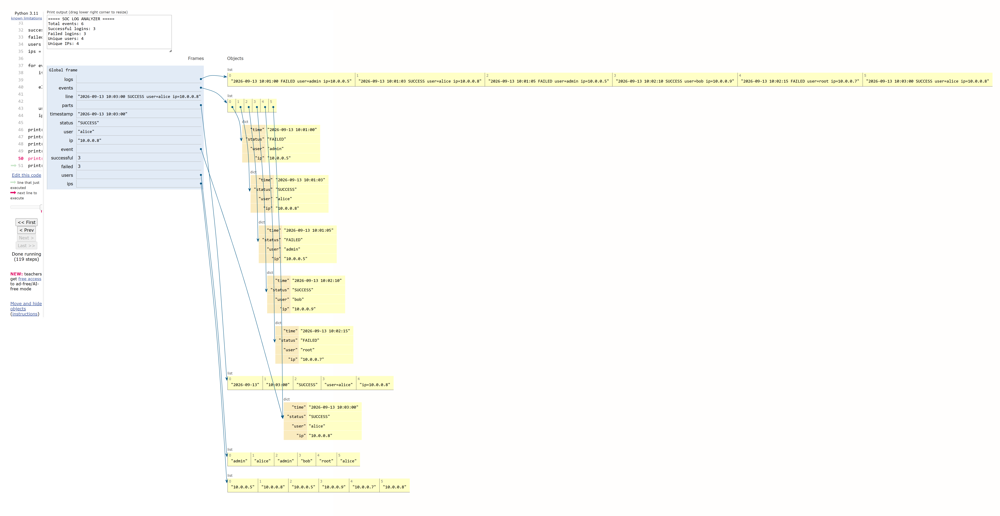

# Day 01 - SOC Log Analyzer

> A foundational defensive cybersecurity project bridging core Data Structures and Algorithms (DSA) with Security Operations Center (SOC) log processing workflows.

[](https://www.python.org/)
[](#dsa-concepts)
[](#cybersecurity-use-case)
[](#day-01-status)

---

## Overview

This project is **Day 01** of a practical **Cybersecurity + DSA Learning Lab**. In defensive security and Security Operations Centers (SOC), analysts ingest high volumes of raw textual logs generated by operating systems, network perimeters, and authentication services.

Before detection rules or analytical pipelines can run, unstructured log records must be parsed into normalized, queryable event structures:

```text
Raw Authentication Logs ──▶ Parsing & Normalization ──▶ Structured Security Events ──▶ Aggregation & Analysis ──▶ SOC Summary
```

This foundational project implements an end-to-end ingestion and analysis script using core Python data structures—lists, strings, and dictionaries—without external dependencies. More sophisticated detection logic, stateful tracking, and windowed correlations will build directly upon this foundation in subsequent lab projects.

---

## Project Objectives

The core objectives implemented in this project cover both systems programming fundamentals and security data handling:

- **File Handling:** Streaming data from disk safely using standard Python context managers (`with open(...)`).
- **Log Parsing:** Ingesting space-delimited text streams and tokenizing individual records.
- **String Manipulation:** Cleaning whitespace, separating delimiter tokens, and extracting key-value components (`user=<name>`, `ip=<addr>`).
- **Lists / Arrays:** Managing ordered event streams and building collections for frequency and uniqueness analysis.
- **Dictionaries:** Structuring normalized event records into key-value entities for field-level access.
- **Iteration:** Traversing parsed records to compute aggregate metrics.
- **Basic Validation:** Enforcing field-count checks to discard malformed or truncated log entries.
- **Security Event Analysis:** Extracting security metrics including authentication outcome tallies and unique entity counts.

---

## Cybersecurity Use Case

Authentication logs are vital telemetry sources for enterprise defense. Every logon attempt across endpoints, VPN concentrators, and directory services leaves an audit trail.

For a SOC tier-1 analyst or incident response pipeline, baseline authentication visibility provides critical situational awareness:

| Log Component | SOC Security Context |
| :--- | :--- |
| **Timestamps** | Establishes chronological sequence for forensic timelines and incident reconstruction. |
| **Outcome (`SUCCESS`)** | Confirms authorized access; monitored for abnormal times or anomalous source locations. |
| **Outcome (`FAILED`)** | Indicates credential mismatch, expired account, or password-guessing activity. |
| **User Identities** | Pinpoints targeted accounts, identifying privileged accounts (e.g., `admin`, `root`) vs. standard users. |
| **Source IP Addresses** | Identifies source subnets, distinguishes internal hosts from remote endpoints, and flags repeated attempts. |
| **Aggregate Activity** | Summarizes volume baselines to quickly contrast normal traffic with elevated anomaly rates. |

> [!NOTE]
> This script represents a foundational parsing and metric-aggregation tool designed for educational log triage. It is not a production SIEM or automated detection platform.

---

## DSA Concepts

### Arrays / Lists

Python lists serve as dynamic arrays in this project:

- **Event Storage (`events = []`):** Holds the sequence of parsed event dictionaries in insertion order. Dynamic resizing provides amortized \(O(1)\) append operations during sequential ingestion.
- **Attribute Aggregation (`users = []`, `ips = []`):** Accumulates observed usernames and IP addresses across all records, creating collections that can be iterated or transformed into hash sets for cardinality determination.

### Strings

Log lines arrive as contiguous character sequences. Parsing converts these flat strings into granular tokens:

- **Cleaning:** Stripping leading/trailing newline and carriage return characters with `.strip()`.
- **Tokenization:** Splitting records into positional tokens using whitespace delimiters with `.split()`.
- **Key-Value Unpacking:** Isolating parameters by splitting on the `=` delimiter:

```python
# Extraction pattern
user = parts[3].split("=")[1]  # "user=admin" -> ["user", "admin"] -> "admin"
ip   = parts[4].split("=")[1]  # "ip=10.0.0.5" -> ["ip", "10.0.0.5"] -> "10.0.0.5"
```

---

## Architecture

The data processing pipeline follows a linear ETL (Extract, Transform, Load/Analyze) workflow:

```text
+-----------------------+
|     Raw Log File      |  (sample_logs.txt on disk)
+-----------------------+
            |
            v
+-----------------------+
|      File Reader      |  (Streaming lines with UTF-8 encoding)
+-----------------------+
            |
            v
+-----------------------+
|     Line Cleaning     |  (Strip whitespace, drop blank lines)
+-----------------------+
            |
            v
+-----------------------+
|    String Parsing     |  (Tokenize via split, validate field count == 5)
+-----------------------+
            |
            v
+-----------------------+
|   Structured Event    |  (Construct dict: time, status, user, ip)
+-----------------------+
            |
            v
+-----------------------+
|   Event Collection    |  (Append into in-memory events list)
+-----------------------+
            |
            v
+-----------------------+
|       Analysis        |  (Iterate: aggregate success/failure counts, gather users/IPs)
+-----------------------+
            |
            v
+-----------------------+
|      SOC Summary      |  (Display total events, login breakdown, unique entity counts)
+-----------------------+
```

### Pipeline Stages

1. **File Reader:** Streams the log file sequentially from disk using a memory-conscious line iterator.
2. **Line Cleaning:** Cleans residual newline characters and ignores blank spacing.
3. **String Parsing:** Splits lines into whitespace-delimited arrays and validates token completeness.
4. **Structured Event:** Transforms string tokens into standardized dictionary representations.
5. **Event Collection:** Accumulates normalized records into a linear dynamic array.
6. **Analysis:** Iterates through collected records to accumulate status counts and identity attributes.
7. **SOC Summary:** Emits formatted telemetry metrics to the console.

---

## Log Format

The analyzer parses space-separated authentication event lines adhering to the following schema:

```text
2026-09-13 09:00:00 FAILED user=admin ip=10.0.0.5
```

### Field Breakdown

| Token Index | Field Example | Description |
| :---: | :--- | :--- |
| `0` + `1` | `2026-09-13 09:00:00` | ISO-style date and time (`YYYY-MM-DD HH:MM:SS`) combined into a unified timestamp string |
| `2` | `FAILED` / `SUCCESS` | Authentication outcome status |
| `3` | `user=admin` | Key-value pair denoting the targeted username |
| `4` | `ip=10.0.0.5` | Key-value pair denoting the source IPv4 address |

> [!NOTE]
> All records in `sample_logs.txt` represent synthetic, non-production test data generated specifically for defensive training.

---

## Dataset

The dataset file [`sample_logs.txt`](sample_logs.txt) contains 150 synthetic authentication records simulating mixed enterprise environment access patterns:

- **Timestamps:** Chronological sequences modeling operational activity.
- **Status Distribution:** A mixture of legitimate `SUCCESS` logons and `FAILED` attempts.
- **Target Identities:** Multiple simulated identities (e.g., `admin`, `root`, `alice`, `charlie`, `analyst`, `guest`, `svc_backup`).
- **Network Origins:** Diverse private network IPv4 addresses across `10.0.0.x` and `192.168.1.x` subnets.
- **Behavioral Patterns:** Interleaved successful access, repeated failed authentication, and multi-host activity.

---

## Project Structure

```text
day-01-soc-log-analyzer/
├── main.py           # Core ingestion, parser, and analysis script
├── sample_logs.txt   # Synthetic authentication log dataset (150 events)
├── soc_log.png       # Execution memory and pointer state visualizer (Python Tutor)
└── README.md         # Comprehensive project documentation
```

### File Descriptions

- **[`main.py`](main.py):** Self-contained executable implementing the extraction, transformation, and analysis logic.
- **[`sample_logs.txt`](sample_logs.txt):** Flat text file with 150 synthetic authentication logs.
- **[`soc_log.png`](soc_log.png):** Visual trace diagram illustrating memory frame allocations, list references, and dictionary mappings during runtime execution.
- **[`README.md`](README.md):** Detailed technical documentation and laboratory breakdown.

---

## How It Works

The execution flow in [`main.py`](main.py) proceeds through 13 discrete operations:

1. **Open log file:** Resolves `LOG_FILE = "sample_logs.txt"` and opens it via `with open(...)` using UTF-8 encoding.
2. **Read line by line:** Iterates over the file object lazily, avoiding full-file buffering into memory.
3. **Strip whitespace:** Invokes `.strip()` to prune trailing newlines (`\n`) and formatting whitespace.
4. **Skip empty lines:** Evaluates `if not line:` to bypass blank rows gracefully.
5. **Split fields:** Tokenizes each line by whitespace using `line.split()`.
6. **Validate field count:** Checks `if len(parts) != 5:` to ensure structural integrity; skips malformed entries.
7. **Extract timestamp:** Concatenates `parts[0]` (date) and `parts[1]` (time) with a space separator.
8. **Extract status:** Reads `parts[2]` directly (`SUCCESS` or `FAILED`).
9. **Extract username:** Isolates the account name via `parts[3].split("=")[1]`.
10. **Extract IP address:** Isolates the origin IP address via `parts[4].split("=")[1]`.
11. **Store structured event:** Appends a dictionary object `{"time": timestamp, "status": status, "user": user, "ip": ip}` to `events`.
12. **Analyze events:** Iterates over `events` to tally `successful` and `failed` attempts while collecting `user` and `ip` values into dedicated lists.
13. **Generate summary:** Outputs the aggregated counts and calculates unique identities via set conversion (`len(set(users))` and `len(set(ips))`).

---

## Example Output

Running `python main.py` against the included synthetic dataset yields the following SOC summary:

```text
===== SOC LOG ANALYZER =====
Total events: 150
Successful logins: 94
Failed logins: 56
Unique users: 8
Unique IPs: 12
```

---

## Complexity Analysis

| Operation | Time Complexity | Space Complexity | Description |
| :--- | :---: | :---: | :--- |
| **Log Parsing** | \(\mathcal{O}(n)\) | \(\mathcal{O}(n)\) | Inspects \(n\) lines once; string splits operate in \(\mathcal{O}(k)\) where \(k \le 80\) chars (constant). Appends \(n\) events to memory. |
| **Event Analysis** | \(\mathcal{O}(n)\) | \(\mathcal{O}(n)\) | Single linear scan through \(n\) events; set conversion of \(n\) entries takes \(\mathcal{O}(n)\) time and \(\mathcal{O}(u)\) space where \(u \le n\). |
| **Overall Pipeline** | \(\mathcal{O}(n)\) | \(\mathcal{O}(n)\) | Linear processing time and auxiliary memory proportional to log event count \(n\). |

Where \(n\) represents the total number of lines/events in the log file.

---

## Python Tutor Visualization

Execution traces were visualized in Python Tutor to inspect memory management, pointer resolution, and data structure construction step-by-step:



### Key Memory Insights Demonstrated

- **Global Frame:** Tracks scalar state (`successful`, `failed`), references to dynamic arrays, and loop iteration variables.
- **List Allocation:** Depicts dynamic arrays (`events`, `users`, `ips`, `parts`) allocating contiguous object references.
- **String Splitting:** Illustrates temporary array generation when tokenizing lines and sub-splitting delimiter pairs.
- **Dictionary Structures:** Shows structured event records mapped as hash tables containing `time`, `status`, `user`, and `ip` keys pointing to immutable string objects.
- **Event Collection:** Visualizes references within the parent `events` list pointing to discrete event dictionaries.

---

## Running the Project

### Prerequisites

- Python 3.8+ (no third-party packages or virtual environment required)

### Execution

Clone the repository and execute from the project directory:

```bash
# Verify Python installation
python --version

# Navigate to the project directory
cd day-01-soc-log-analyzer

# Execute the analyzer
python main.py
```

On Windows systems using the Python launcher:

```powershell
py main.py
```

---

## Learning Outcomes

### Programming & DSA Perspective

- Solidified linear file streaming and tokenization techniques.
- Explored dynamic array growth behaviors and pointer referencing in Python lists.
- Implemented dictionary modeling for structured data normalization.
- Applied set conversion for distinct element deduction (\(\mathcal{O}(n)\) average-time uniqueness).
- Evaluated algorithmic complexity and runtime memory tradeoffs.

### Cybersecurity Perspective

- Analyzed the anatomy of authentication log records and standardized fields.
- Understood the importance of defensive log sanitization and malformed record validation.
- Built visibility baselines for monitoring success vs. failure ratios.
- Identified primary security indicators: user identity distribution and network address dispersion.

---

## Current Limitations

To maintain a pure foundational focus on Day 01 DSA concepts, this implementation intentionally omits:

- **Brute-Force Detection:** No threshold-based alert triggers for consecutive failed attempts.
- **Time-Window Correlation:** No sliding temporal windows to detect burst anomalies.
- **IOC Matching:** No lookup against known malicious IP address blacklists.
- **Threat Intelligence Feeds:** No integration with external reputation systems.
- **Alert Prioritization:** No risk scoring or priority queue triaging.
- **Real-Time Monitoring:** No live stream tailing (`tail -f`) or socket listening.
- **Advanced Anomaly Detection:** No statistical baseline deviation modeling.

---

## Future Evolution

Subsequent laboratory projects will progressively incorporate higher-order data structures and algorithmic paradigms to address defensive engineering challenges:

| Data Structure / Algorithm | Planned Security Application |
| :--- | :--- |
| **Hash Maps / Frequency Tables** | State-tracking failed logons per user and per IP address. |
| **Hash Sets** | Constant-time \(\mathcal{O}(1)\) Indicators of Compromise (IOC) deduplication and matching. |
| **Sliding Window** | Temporal threshold detection for brute-force and password spraying attacks. |
| **Min/Max Heaps** | Real-time incident risk scoring and triage alert prioritization. |
| **Graphs & Trees** | Lateral movement tracking, active directory path analysis, and network mapping. |

---

## Security Disclaimer

The logs and scenarios included in this repository are synthetic, educational datasets created strictly for defensive cybersecurity education and algorithmic study.

- Do not test or execute against unauthorized production infrastructure.
- Do not import real personal identifiable information (PII), corporate credentials, or sensitive network telemetry.
- All code is intended solely for academic analysis and blue-team skill development.

---

## Learning Method

This laboratory is organized around an engineering-first pedagogical cycle:

```text
DSA Concept ──▶ Cybersecurity Problem ──▶ Python Implementation ──▶ Execution Visualization ──▶ Documentation ──▶ Version Control Tracking
```

Every project demonstrates how theoretical computer science concepts translate directly into effective defensive tools.

---

## Day 01 Status

- [x] Authentication log dataset created (`sample_logs.txt`)
- [x] File-based log ingestion
- [x] String parsing and tokenization
- [x] Structured security event modeling
- [x] Authentication statistics aggregation
- [x] Python Tutor visual memory analysis
- [x] Comprehensive documentation and complexity profiling

---

## Author

**Aryan Singh**  
Cybersecurity & Software Engineering Lab  
GitHub: [@tigpy](https://github.com/tigpy)

---

## Repository

Complete source code, datasets, and subsequent daily lab exercises:  
[https://github.com/tigpy/cybersecurity-dsa-lab](https://github.com/tigpy/cybersecurity-dsa-lab)