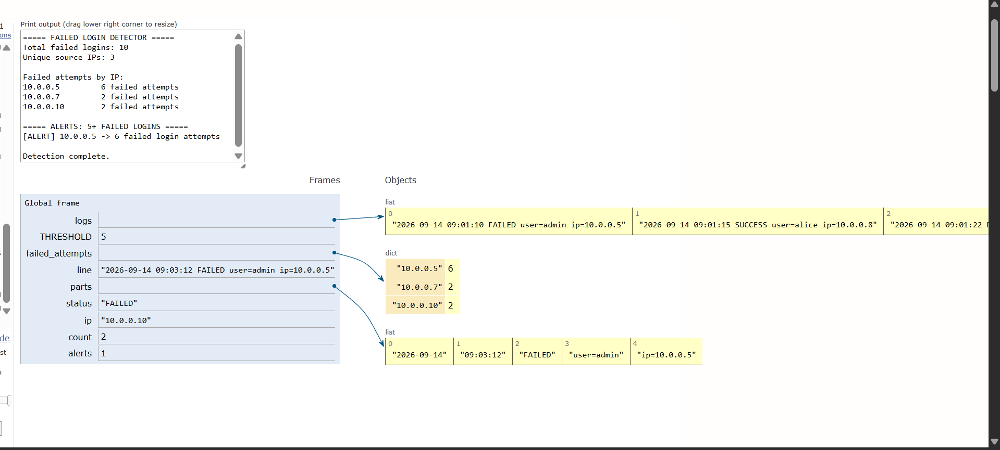

# Day 02 - Failed Login Detector

> A defensive cybersecurity project applying Hash Maps (Dictionaries) to aggregate authentication failure telemetry, compute IP-level failure frequencies, and fire threshold-based security alerts.

[](https://www.python.org/)
[](#dsa-concept-hash-maps)
[](#cybersecurity-use-case)
[](#day-02-status)

---

## Overview

In enterprise defensive security and Security Operations Centers (SOC), authentication telemetry is among the highest-volume and most critical data streams. Every login event across servers, VPN endpoints, firewalls, and active directories creates an audit trail. A critical pattern security analysts search for is **repeated failed authentication attempts** originating from a single source.

A sudden surge in failed logins from a specific IP address often indicates an automated attack—such as brute-force credential attacks, dictionary attacks, or password spraying. Without efficient aggregation, a SOC analyst would have to manually comb through hundreds of thousands of individual events. 

The **Failed Login Detector** demonstrates how the **Hash Map** (Python `dict`) provides an optimal, highly scalable data structure to track, count, and evaluate failed logins per source IP in \(O(1)\) average time, transforming raw log records into actionable security alerts.

---

## Objectives

This project bridges fundamental computer science data structures with real-world security monitoring tasks:

- **Hash Maps / Dictionaries:** Master key-value mapping to aggregate frequency distributions across network entities.
- **Log Parsing:** Ingest and parse structured server authentication log records safely.
- **Counting Events:** Dynamically track event occurrences per unique key using hash-table lookups and mutations.
- **Threshold-Based Detection:** Implement rule-based detection logic to identify anomalously high failure volumes.
- **Basic Security Alert Generation:** Separate benign noise from actionable security alerts based on defined behavioral thresholds.
- **Defensive Error Handling:** Ensure streaming pipelines handle empty lines and malformed entries cleanly without crashing.

---

## Cybersecurity Use Case

In a Security Operations Center (SOC), Tier-1 analysts monitor Security Information and Event Management (SIEM) systems for authentication anomalies. When a host repeatedly attempts to log in with invalid credentials:

| Security Scenario | Indicator | Analyst Investigation |
| :--- | :--- | :--- |
| **Brute-Force Attack** | High volume of failures targeting privileged accounts (`admin`, `root`). | Check if attempts are rapid and sequential; verify source IP location and block at firewall. |
| **Password Spraying** | Failures across multiple distinct usernames from the same source IP. | Determine if an attacker is trying common passwords against active directory accounts. |
| **Misconfigured Service** | Periodic failures on service accounts from an internal host. | Verify whether an internal daemon has an expired API token or stale service password. |
| **Benign User Error** | 1–3 failures followed by a successful authentication. | Normal human behavior (e.g., mistyped password); usually safe to ignore. |

> [!NOTE]
> This project is a focused, educational proof-of-concept demonstrating log aggregation and threshold alerting fundamentals. It is not a full-scale enterprise SIEM or distributed detection engine.

---

## DSA Concept: Hash Maps

A **Hash Map** (implemented as a Python dictionary) stores elements in **key-value pairs**. It calculates an index into an array of buckets using a hash function applied to the key, enabling average-case **\(O(1)\)** time complexity for lookups, insertions, and updates.

### Conceptual Structure

In this project, the **source IP address** acts as the unique **key**, and the accumulated **failed login count** acts as the **value**:

$$\text{Source IP (Key)} \longrightarrow \text{Failed Login Count (Value)}$$

```python
{
    "10.0.0.5": 7,
    "10.0.0.7": 2,
    "10.0.0.10": 5
}
```

### Lookup and Update Operation

When processing each log record:
1. We check if the source IP already exists in our Hash Map.
2. If it does not exist, we initialize its counter at `0`.
3. We increment the stored counter by `1`.

In Python, this is executed idiomatically using `.get()`:
```python
failed_attempts[ip] = failed_attempts.get(ip, 0) + 1
```

Using a Hash Map ensures that even if our log file grows to millions of entries, looking up and updating an IP's failure count remains near-instantaneous on average.

---

## Detection Logic

The following ASCII diagram illustrates the event processing flow from raw log ingestion to alert emission:

```text
auth_logs.txt
      ↓
   Read log
      ↓
 Parse fields
      ↓
Check STATUS
      ↓
   FAILED?
   /       \
 No         Yes
 |           |
skip       get IP
             ↓
       Hash Map Counter
             ↓
       Threshold Check
             ↓
           ALERT
```

---

## Log Format

Each line in `auth_logs.txt` adheres to a standard space-delimited authentication audit format:

```text
YYYY-MM-DD HH:MM:SS STATUS user=USERNAME ip=IP_ADDRESS
```

### Field Breakdown

| Field | Example Value | Description |
| :--- | :--- | :--- |
| **`YYYY-MM-DD`** | `2026-09-14` | The calendar date of the authentication attempt. |
| **`HH:MM:SS`** | `08:04:02` | The local 24-hour timestamp of the event. |
| **`STATUS`** | `FAILED` or `SUCCESS` | Authentication outcome flag evaluated by the detector. |
| **`user=USERNAME`** | `user=admin` | The target identity or account handle requested. |
| **`ip=IP_ADDRESS`** | `ip=10.0.0.5` | The source network IP initiating the authentication attempt. |

---

## Dataset

The included `auth_logs.txt` file contains approximately 176 synthetic authentication records designed to emulate realistic enterprise authentication traffic:

- **Synthetic Data:** Strictly private internal network addresses (`10.0.0.x`, `192.168.1.x`) and simulated usernames (`admin`, `root`, `alice`, `bob`, `charlie`, `david`, `eva`, `frank`, `service_account`, `db_admin`, `test`).
- **Realistic Event Mix:** Balanced combination of routine successful logins (`SUCCESS`) alongside authentication failures (`FAILED`).
- **Threshold-Crossing Entities:** Specific IP addresses (e.g., `10.0.0.5`, `192.168.1.50`, `10.0.0.10`, `192.168.1.75`) intentionally generated with 5 or more failed attempts to trigger alerts.
- **Low-Failure Benign Hosts:** Multiple IPs with 1–3 failed logins representing typical benign password typos.
- **Resilience Testing:** Includes empty lines and malformed entries to demonstrate defensive log parsing.

---

## Project Structure

```text
day-02-failed-login-detector/
├── main.py
├── auth_logs.txt
├── failed_login.png
└── README.md
```

- **`main.py`**: Standalone production Python script executing file ingestion, hash map aggregation, and threshold alerting.
- **`auth_logs.txt`**: Synthetic dataset containing ~176 authentication events.
- **`failed_login.png`**: Step-by-step visual execution trace from Python Tutor showing hash map state mutations.
- **`README.md`**: Project documentation, conceptual background, and security analysis.

---

## How It Works

The detector executes through the following step-by-step pipeline:

1. **Open `auth_logs.txt`:** Utilizes Python's context manager (`with open(...)`) for safe disk streaming.
2. **Read each line:** Iterates over the file line by line without loading the entire raw file into memory at once.
3. **Clean whitespace:** Strips trailing newlines and extraneous whitespace via `.strip()`.
4. **Validate structure:** Filters out empty lines and skips malformed records where field length differs from expected tokens (`len(parts) != 5`).
5. **Split the log:** Splits the entry into whitespace-delimited tokens.
6. **Extract status:** Inspects index `2` to determine whether the event is `FAILED` or `SUCCESS`.
7. **Extract source IP:** Safely extracts the IP value by isolating the string prefix after `ip=`.
8. **Filter FAILED events:** Discards `SUCCESS` entries from the failure counter pipeline.
9. **Update the Hash Map:** Increments the integer counter mapped to the extracted source IP in `failed_attempts`.
10. **Compare counts against THRESHOLD:** Iterates through the Hash Map keys and flags any IP whose count meets or exceeds `THRESHOLD` (default: `5`).
11. **Generate alerts:** Prints formatted SOC-style alerts highlighting high-risk source IP addresses.

---

## Example Output

When running `main.py` against `auth_logs.txt`, the detector generates the following formatted output:

```text
===== FAILED LOGIN DETECTOR =====
Total failed logins: 46
Unique source IPs: 10

Failed attempts by IP:
10.0.0.15        2 failed attempts
10.0.0.5         14 failed attempts
192.168.1.75     6 failed attempts
10.0.0.7         3 failed attempts
192.168.1.20     2 failed attempts
10.0.0.10        7 failed attempts
192.168.1.50     9 failed attempts
10.0.0.12        1 failed attempts
192.168.1.140    1 failed attempts
10.0.0.22        1 failed attempts

===== ALERTS: 5+ FAILED LOGINS =====
[ALERT] 10.0.0.5 -> 14 failed login attempts
[ALERT] 192.168.1.75 -> 6 failed login attempts
[ALERT] 10.0.0.10 -> 7 failed login attempts
[ALERT] 192.168.1.50 -> 9 failed login attempts

Detection complete.
```

---

## Complexity Analysis

### Time Complexity: \(O(n)\)
- Let \(n\) be the total number of log lines in `auth_logs.txt`.
- Reading and splitting each log entry takes \(O(1)\) time relative to the fixed string length.
- Hash map lookup and insertion (`failed_attempts.get(ip, 0) + 1`) runs in **\(O(1)\) average time**.
- Checking thresholds at the end takes \(O(k)\) time, where \(k \le n\).
- Overall time complexity: **\(O(n)\)** linear scan.

### Space Complexity: \(O(k)\)
- Let \(k\) be the number of **unique source IPs** that recorded at least one failed login attempt.
- The Hash Map stores at most \(k\) key-value entries.
- In the worst case where every single log entry has a unique IP address, \(k = n\), yielding \(O(n)\). In realistic network environments, \(k \ll n\) as repeated requests share addresses.
- Overall space complexity: **\(O(k)\)**.

---

## Python Tutor Visualization

To visually observe how the Hash Map dynamically expands and updates its internal buckets in memory, a condensed 15-line dataset can be executed in [Python Tutor](https://pythontutor.com/):

```python
# 15-event subset for Python Tutor visualization
logs = [
    "2026-09-14 09:01:10 FAILED user=admin ip=10.0.0.5",
    "2026-09-14 09:01:15 SUCCESS user=alice ip=10.0.0.8",
    "2026-09-14 09:01:22 FAILED user=admin ip=10.0.0.5",
    "2026-09-14 09:01:30 FAILED user=root ip=10.0.0.7",
    "2026-09-14 09:01:35 SUCCESS user=bob ip=10.0.0.9",
    "2026-09-14 09:01:42 FAILED user=admin ip=10.0.0.5",
    "2026-09-14 09:01:50 FAILED user=test ip=10.0.0.10",
    "2026-09-14 09:02:03 FAILED user=admin ip=10.0.0.5",
    "2026-09-14 09:02:11 SUCCESS user=alice ip=10.0.0.8",
    "2026-09-14 09:02:18 FAILED user=admin ip=10.0.0.5",
    "2026-09-14 09:02:25 FAILED user=root ip=10.0.0.7",
    "2026-09-14 09:02:40 SUCCESS user=charlie ip=10.0.0.11",
    "2026-09-14 09:02:51 FAILED user=test ip=10.0.0.10",
    "2026-09-14 09:03:05 SUCCESS user=bob ip=10.0.0.9",
    "2026-09-14 09:03:12 FAILED user=admin ip=10.0.0.5"
]

THRESHOLD = 5
failed_attempts = {}

for line in logs:
    parts = line.split()
    if len(parts) != 5:
        continue

    status = parts[2]
    ip = parts[4].split("=")[1]

    if status == "FAILED":
        failed_attempts[ip] = failed_attempts.get(ip, 0) + 1
```

The step-by-step memory visualization illustrates the Hash Map pointer references and incremental integer counters changing dynamically as failed authentication records are processed:



As demonstrated in the Python Tutor trace above, the `failed_attempts` dictionary maps distinct string keys representing source IPs directly to their integer frequencies. When `10.0.0.5` encounters consecutive `FAILED` records, its corresponding value is updated in place, while `SUCCESS` records bypass the counter entirely.

---

## How to Run

### Requirements
- Python 3.x (Standard library only; no external packages needed)

### Execution
From within the project directory:

```bash
cd day-02-failed-login-detector
python main.py
```

Or directly from the repository root:

```bash
python day-02-failed-login-detector/main.py
```

---

## Learning Outcome

Through implementing Day 02, key insights were gained across both engineering dimensions:

### DSA Insights
- **Key-Value Indexing:** How hash functions map arbitrary immutable keys (strings like IP addresses) to memory locations.
- **Frequency Counter Pattern:** Leveraging dictionaries to aggregate distribution statistics over an unsorted input stream.
- **Complexity Advantage:** Understanding why hash maps outperform naive linear searches (\(O(n)\) vs. \(O(n^2)\) if re-scanning lists).

### Cybersecurity Insights
- **Authentication Telemetry:** Interpreting audit logs to distinguish benign misconfigurations from malicious credential guessing.
- **Behavioral Thresholds:** Applying quantitative cutoffs to filter alert fatigue in SOC monitoring queues.
- **Entity Grouping:** Grouping logs by pivot fields (source IP, target username) to expose high-risk threat actors.

---

## Current Limitations

This educational implementation intentionally maintains a simple, readable architecture. In a real-world enterprise SOC environment, the following limitations apply:

- **No Time-Window Analysis:** It aggregates all failures cumulatively across the entire log file rather than within a sliding window (e.g., 5 failures in 60 seconds).
- **No Behavioral Baselines:** It uses a static threshold rather than adaptive machine learning baselines per user or host.
- **No Threat Intelligence / Reputation:** It does not query external IP reputation feeds or GeoIP databases.
- **No Account Correlation:** It does not correlate multiple usernames targeted by a single IP to identify distributed password spraying.
- **No Real-Time Streaming:** It operates as an offline batch processor rather than streaming live syslog or event hubs.
- **No SIEM Integration:** Does not produce standard Common Event Format (CEF) or JSON payloads for ingestion into SIEM tools like Splunk or Microsoft Sentinel.

---

## Future Evolution

As this lab series progresses, the concepts introduced here will evolve into more sophisticated detection capabilities:

- **Sliding-Window Brute-Force Detection:** Tracking timestamps using double-ended queues (Deques) to detect $M$ failures within $N$ minutes.
- **Credential Stuffing & Spray Correlation:** Using multi-key hash maps (`ip -> set(users)` and `user -> set(ips)`) to detect coordinated attacks.
- **SIEM Pipeline Integration:** Outputting alerts in standardized JSON / CEF formats.
- **Dynamic Blacklisting / Active Response:** Triggering automated firewall null-routes for offending IPs.

---

## Security Disclaimer

All authentication logs, timestamps, user identities, and IP addresses in this project are **entirely synthetic** and created strictly for educational, defensive security training. 

Do not use real corporate credentials, personal data, or production logs without explicit written authorization. This project is built solely to study defensive detection engineering.

---

## Day 02 Status

- [x] Synthetic authentication dataset
- [x] File-based log ingestion
- [x] Hash Map failed-login counting
- [x] Threshold-based alerts
- [x] Malformed-line handling
- [x] Documentation

---

## Author

**Aryan Singh**  
Cybersecurity learner focused on:
- Python
- Data Structures & Algorithms (DSA)
- Security Operations Center (SOC)
- Security Engineering
