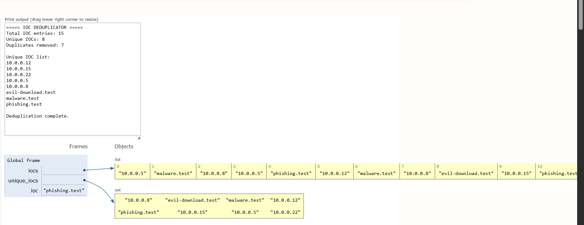

# Day 03 - IOC Deduplicator

> A defensive cybersecurity learning project demonstrating how Sets can efficiently remove duplicate Indicators of Compromise.

[](https://www.python.org/)
[](#dsa-concept-sets)
[](#cybersecurity-use-case)
[](#day-03-status)

---

## Overview

In cybersecurity operations, an **Indicator of Compromise (IOC)** is an observable artifact or piece of forensic data that indicates potential unauthorized access, malicious activity, or system compromise. Common examples of IOCs include:

- **IP Addresses:** External source hosts associated with botnets, vulnerability scanners, or unauthorized remote access (e.g., `10.0.0.5`, `192.168.1.50`).
- **Domain Names / URLs:** Hostnames used for command-and-control (C2) communication, phishing landing pages, or malicious downloads (e.g., `malware.test`, `phishing.test`).
- **Cryptographic File Hashes:** MD5, SHA-1, or SHA-256 signatures identifying known malware executables or modified binaries (e.g., `e99a18c428cb38d5f260853678922e03`).

Security Operations Centers (SOCs) and Threat Intelligence teams routinely ingest IOC feeds from dozens of distinct sources, including commercial feeds, open-source intelligence (OSINT), internal incident response reports, and automated firewall alerts. Because these feeds frequently monitor overlapping threats, the raw inbound feed data contains massive amounts of **duplicate IOCs**.

The **IOC Deduplicator** demonstrates how the **Set** data structure solves this problem efficiently by filtering redundant indicators, minimizing storage overhead, and optimizing downstream defensive processing.

---

## Objectives

This project connects fundamental computer science data structures with real-world security data processing workflows:

- **Learn Sets:** Understand the mechanics, properties, and behavior of Python's built-in `set` data structure.
- **Understand Uniqueness:** Explore how mathematical sets enforce distinct elements automatically.
- **Remove Duplicate IOCs:** Eliminate redundant threat indicators from incoming threat feeds.
- **Process IOC Data from a File:** Build a clean file-ingestion pipeline reading from an external dataset (`iocs.txt`).
- **Understand Average Constant-Time Insertion:** Analyze the $O(1)$ average-time complexity of hash-table-backed set insertions.
- **Connect DSA with Cybersecurity:** Bridge algorithmic efficiency with defensive threat-intelligence staging and firewall rule generation.

---

## Cybersecurity Use Case

Why does deduplication matter in enterprise security operations?

1. **Firewall & Perimeter Rule Limits:** Next-Generation Firewalls (NGFWs) and routers have strict limits on access control list (ACL) sizes and blocklist memory. Pushing duplicate IPs degrades network device performance and wastes finite hardware table space.
2. **SIEM / EDR Query Performance:** Security Information and Event Management (SIEM) solutions query active logs against indicator watchlists. Querying against thousands of duplicate entries slows down correlation rules and increases indexing latency.
3. **Alert Fatigue Prevention:** Ingesting the same indicator from multiple threat feeds without deduplication can generate multiple redundant alerts for a single security incident.
4. **Data Normalization & Staging:** Before threat data is pushed to threat intelligence platforms (TIP) or sharing feeds (like MISP or STIX/TAXII), deduplication is a mandatory data sanitization step.

> [!NOTE]
> This project is a focused, educational proof-of-concept demonstrating Set-based deduplication fundamentals. It is not a commercial threat-intelligence platform or distributed ingestion engine.

---

## DSA Concept: Sets

A **Set** is an unordered collection of unique, immutable elements. In Python, sets are implemented under the hood using **hash tables** (similar to dictionaries without values).

### Set Mechanics in Python

We initialize an empty set and insert items using `.add()`:

```python
unique_iocs = set()

for ioc in iocs:
    unique_iocs.add(ioc)
```

When an element is added to a set:
1. Python computes the hash of the element: `hash(ioc)`.
2. It checks the hash table bucket.
3. If an identical element already exists in that bucket, the insertion is ignored without error.
4. If it does not exist, the element is stored.

### List vs. Set Comparison

| Feature | Python `list` | Python `set` |
| :--- | :--- | :--- |
| **Duplicates Allowed?** | Yes | **No** (strictly unique elements) |
| **Ordering** | Preserves insertion order | Unordered |
| **Search / Membership (`in`)** | $O(n)$ linear search | **$O(1)$** average hash lookup |
| **Deduplication Method** | Requires nested scan or sorting | **Automatic** on insertion |
| **Underlying Structure** | Dynamic Array | Hash Table |

### Uniqueness Demonstration

```text
Raw Inbound IOC Stream:
A
B
A
C
B
A

Stored in Set:
A
B
C
```

---

## Detection / Processing Flow

The following ASCII diagram illustrates the end-to-end deduplication pipeline:

```text
       iocs.txt
          │
          ▼
      Read IOC
          │
          ▼
   Clean whitespace
          │
          ▼
     Add to Set
          │
          ▼
     Duplicate?
       /     \
     Yes      No
      │        │
   Ignored   Stored
       \      /
          ▼
    Unique IOC Set
          │
          ▼
   Calculate Counts
          │
          ▼
       Summary
```

---

## IOC Dataset

The production dataset is located in `day-03-IOC-Deduplicator/iocs.txt`:

- **Total Entries:** Approximately 150–200 synthetic IOC records (including intentional duplicates and empty lines).
- **Indicator Types:**
  - **IPv4 Addresses:** Sourced strictly from RFC 1918 private ranges (`10.0.0.x`, `192.168.1.x`, `172.16.x.x`).
  - **Domain Names:** Sourced strictly from IANA-reserved and test domains (`malware.test`, `phishing.test`, `c2-beacon.test`, `suspicious.test`).
  - **File Signatures:** Synthetic 32-character hexadecimal hashes representing file digests.
- **Educational Safety:** All data is synthetic and non-routable. No live malicious infrastructure or real threat intelligence is included.

---

## Project Structure

```text
day-03-IOC-Deduplicator/
├── main.py
├── iocs.txt
├── ioc_deduplication.png
└── README.md
```

- **`main.py`**: Production file-based Python script implementing Set deduplication and metric reporting.
- **`iocs.txt`**: Synthetic threat intelligence feed file containing IP, domain, and hash indicators.
- **`ioc_deduplication.png`**: Python Tutor step-by-step visual execution diagram.
- **`README.md`**: Comprehensive defensive security documentation and complexity analysis.

---

## How It Works

The deduplication script executes through the following steps:

1. **Open `iocs.txt`:** Opens the external indicator file safely using Python's context manager (`with open(...) as file:`).
2. **Stream Line-by-Line:** Reads each line sequentially to maintain minimal memory footprint.
3. **Strip Whitespace:** Cleans leading and trailing whitespace characters (spaces, tabs, newlines) with `.strip()`.
4. **Ignore Empty Lines:** Skips blank lines safely to prevent empty string artifacts in the set.
5. **Add IOC to Set:** Executes `unique_iocs.add(ioc)`.
6. **Automatic Deduplication:** The Set automatically prevents duplicate storage using internal hash matching.
7. **Count Metrics:** Dynamically tracks total valid entries parsed versus `len(unique_iocs)`.
8. **Compute Redundancy:** Calculates `duplicates_removed = total_entries - len(unique_iocs)`.
9. **Display Unique IOCs:** Prints sorted unique indicators followed by a summary status.

---

## Example

### Simplified Input Data (`iocs.txt`)

```text
10.0.0.5
malware.test
10.0.0.5
phishing.test
malware.test
```

### Output Concept

```text
10.0.0.5
malware.test
phishing.test
```

Duplicates for `10.0.0.5` and `malware.test` are automatically suppressed by the Set during iteration.

---

## Complexity Analysis

Let:
- $n$ = total raw IOC entries in `iocs.txt`
- $k$ = number of unique IOCs ($k \le n$)

| Metric | Complexity | Explanation |
| :--- | :--- | :--- |
| **Average Insertion** | $O(1)$ | Python sets use hash tables. Computing the hash and resolving the bucket takes constant time on average. |
| **Total Ingestion Time** | $O(n)$ | We iterate through all $n$ lines once. Performing $n$ operations of $O(1)$ work yields overall linear time. |
| **Space Complexity** | $O(k)$ | The set only allocates memory for $k$ unique indicators, effectively freeing space that duplicate entries would consume. |

> [!TIP]
> In contrast, using a Python `list` and checking `if ioc not in unique_list:` would require scanning the list for every insertion, degrading the overall runtime to $O(n \times k)$ or $O(n^2)$. The Set reduces this to $O(n)$.

---

## Python Tutor Visualization

Python Tutor was used to visually observe memory allocation and verify how the Set handles duplicate IOCs step by step:



### What the Visualization Demonstrates

- **Heap Allocation:** As each indicator is read from the stream, the Python runtime allocates the string object and hashes it into the `set` object.
- **Collision & Duplicate Handling:** When recurring indicators (such as `10.0.0.5` and `malware.test`) appear a second or third time, the set identifies that the hash and value already reside in the table and leaves the set unaltered.
- **Reference Management:** The visualization confirms that the set size only increments when genuinely distinct indicators are introduced.

---

## How to Run

### Requirements

- Python 3.x (Standard library only; no external packages needed)

### Execution

Navigate to the project folder and run `main.py`:

```bash
cd day-03-IOC-Deduplicator
python main.py
```

### Sample Output

```text
===== IOC DEDUPLICATOR =====

Total IOC entries: 196
Unique IOCs: 71
Duplicates removed: 125

===== UNIQUE IOCs =====

098f6bcd4621d373cade4e832627b4f6
10.0.0.101
10.0.0.12
10.0.0.15
10.0.0.150
10.0.0.200
10.0.0.22
10.0.0.45
10.0.0.5
10.0.0.8
10.0.0.99
...
worm-propagation.test
zero-day-test.test

===== SUMMARY =====

Deduplication complete.
```

---

## Learning Outcome

### DSA (Data Structures & Algorithms)

- **Sets:** Deep understanding of set theory applied to algorithmic data deduplication.
- **Uniqueness Guarantee:** Leveraging hash-based uniqueness guarantees rather than manual nested iteration.
- **Membership Operations:** Recognizing how hash functions deliver average $O(1)$ insertion and lookup performance.
- **Time/Space Trade-offs:** Evaluating memory footprint ($O(k)$ space) relative to streaming execution speed ($O(n)$ time).

### Cybersecurity

- **IOC Management:** Practical experience handling heterogeneous indicator streams (IPs, domains, hashes).
- **Data Normalization:** Preparing raw threat feeds for ingest into downstream detection mechanisms.
- **Security Resource Optimization:** Preventing firewall rule exhaustion and SIEM query degradation caused by redundant indicators.
- **Defensive Engineering Mindset:** Building clean, resilient data pipelines that handle blank lines and whitespace variations gracefully.

---

## Limitations

This project is a DSA-focused educational tool and intentionally omits certain enterprise capabilities:

- **No Reputation Scoring:** Does not query threat reputation databases (e.g., VirusTotal, AbuseIPDB).
- **No Live Threat Lookups:** Does not make external network or API calls.
- **No Malware Sandboxing:** Does not analyze executable behavior or payloads.
- **No Complex Validation:** Treats any non-empty string as a potential indicator without RFC/regex validation.
- **No Real-Time Streaming:** Operates in batch mode over a static file rather than streaming over Kafka or syslog.
- **No Threat Attribution:** Does not map indicators to APT groups or MITRE ATT&CK techniques.

---

## Future Improvements

Potential enhancements for future iterations:

- **IOC Type Classification:** Automatically categorize indicators into IP, Domain, URL, or Hash categories.
- **Case Normalization:** Standardize domain names to lowercase (e.g., `MALWARE.TEST` $\rightarrow$ `malware.test`) prior to set insertion.
- **Multiple Feed Ingestion:** Merge and deduplicate indicators across multiple input files or REST APIs.
- **JSON & STIX Support:** Support standardized threat intelligence exchange formats (STIX 2.1, JSON, CSV).
- **Frequency Tracking:** Combine Sets with Hash Maps to track indicator recurrence frequency across feeds.
- **SIEM / Firewall Export:** Generate formatted output ready for direct import into pfSense, Suricata, or Zeek watchlists.

---

## Security Disclaimer

All IP addresses, domain names, and cryptographic file hashes in this repository are **completely synthetic and educational**. 
- IP addresses are confined to private RFC 1918 subnets.
- Domains utilize reserved `.test` TLDs.
- Hashes are artificial test digests.

This project is intended solely for defensive cybersecurity education and algorithmic training. Never import sensitive or production operational data into testing environments without proper authorization.

---

## Day 03 Status

- [x] Synthetic IOC dataset (`iocs.txt`)
- [x] File-based ingestion pipeline
- [x] Set-based deduplication logic
- [x] Dynamic duplicate and unique metric calculation
- [x] Unique IOC reporting
- [x] Python Tutor visual execution evidence (`ioc_deduplication.png`)
- [x] Comprehensive documentation and complexity analysis

---

## Author

**Aryan Singh**  
Cybersecurity learner focused on:
- Python & Automation
- Data Structures & Algorithms (DSA)
- Security Operations Center (SOC)
- Security Engineering
