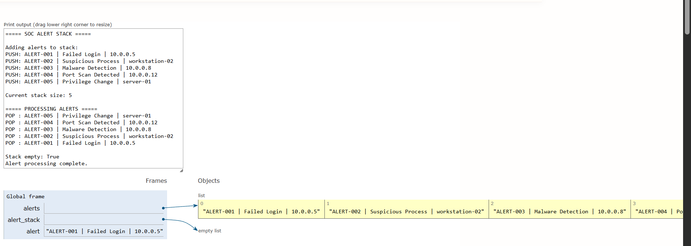

# Day 04 - SOC Alert Stack

> A defensive cybersecurity learning project demonstrating Stack data structures through SOC alert processing.

[](https://www.python.org/)
[-orange)](#dsa-concept-stack)
[](#cybersecurity-use-case)
[](#day-04-status)

---

## Overview

In defensive cybersecurity operations, Security Operations Center (SOC) analysts and automated triage systems continuously handle incoming security alerts. This project explores how fundamental Data Structures and Algorithms (DSA)—specifically the **Stack**—can model sequential, stateful investigation workflows.

A **Stack** is a linear data structure that adheres strictly to the **LIFO (Last In, First Out)** principle. In this educational project, security alerts are ingested from a log source, pushed sequentially onto a stack, and then popped in reverse order so that the most recent alerts are evaluated first.

> [!NOTE]
> This project is an educational model designed to illustrate Stack mechanics and LIFO behavior using security concepts. Real-world SOC platforms and SIEM engines typically prioritize alerts using multi-factor risk scoring, severity tiers, priority queues, and correlation graphs rather than a raw universal stack.

---

## Objectives

- **Learn Stack:** Understand the core concepts, internal mechanics, and structural constraints of the Stack data structure.
- **Understand LIFO:** Master the Last In, First Out operational paradigm.
- **Implement PUSH:** Apply stack insertion using Python list's `append()` operation.
- **Implement POP:** Apply stack removal using Python list's `pop()` operation.
- **Process Security Alerts:** Ingest, parse, and process synthetic defensive security events line-by-line.
- **Connect DSA with Cybersecurity Workflows:** Understand how stack mechanics apply to security scenarios such as nested incident analysis, execution trace unwind, and forensic undo operations.

---

## Cybersecurity Use Case

While modern SIEM systems do not exclusively process incoming alerts via a simple LIFO stack, Stack-like behavior is prevalent across multiple cybersecurity and engineering domains:

- **Investigation Context & Drill-Down:** When an analyst investigates an alert (e.g., Suspicious PowerShell execution), they often pivot into child processes or network connections, pushing the previous analytical state onto an investigation stack. Once the sub-investigation concludes, they pop back to the parent context.
- **Nested Investigation Steps:** Incident response playbooks often execute nested forensic tasks (Memory Dump $\rightarrow$ Process Inspection $\rightarrow$ Handle Enumeration). When each step finishes, the analyst pops back up the execution chain.
- **Recent Event Handling:** In fast-moving tactical triage, an analyst may want to immediately inspect the freshest, most recently triggered alerts before older ones to catch ongoing, active adversary footholds.
- **Rollback / Undo-Style Operations:** Remediation tools and containment orchestrators maintain an action stack to safely reverse defensive configuration changes (e.g., removing newly added firewall rules or un-quarantining false positives).
- **Parser & AST Workflows:** Security compilers, Sigma rule parsers, and YARA compilers rely on stacks for parenthesis matching, syntax tree evaluation, and nested boolean expression parsing.

---

## DSA Concept: Stack

A **Stack** is a collection of elements with two principal operations:
- **PUSH:** Adds an element to the top of the collection.
- **POP:** Removes and retrieves the most recently added element from the top of the collection.

### LIFO Principle (Last In, First Out)

The element placed last into the stack is always the first one to be removed.

Suppose alerts arrive in this sequence:
```text
ALERT-001
ALERT-002
ALERT-003
ALERT-004
```

When processed from the stack:
```text
POP → ALERT-004  (Newest alert processed first)
POP → ALERT-003
POP → ALERT-002
POP → ALERT-001  (Oldest alert processed last)
```

In standard Python, a dynamic array (`list`) natively implements stack operations:
- `alert_stack.append(alert)` $\rightarrow$ **PUSH**
- `alert_stack.pop()` $\rightarrow$ **POP**

---

## Stack Visualization

```text
             TOP
              ↓
       ┌──────────────┐
       │   ALERT-004  │ ← POP FIRST
       ├──────────────┤
       │   ALERT-003  │
       ├──────────────┤
       │   ALERT-002  │
       ├──────────────┤
       │   ALERT-001  │ ← POP LAST
       └──────────────┘
```

When new items are pushed, they are placed on top of the stack. When items are popped, they are removed from the top, preserving the LIFO invariant.

---

## Processing Flow

```text
alerts.txt
    ↓
Read alert
    ↓
Validate line
    ↓
PUSH into Stack
    ↓
Stack contains alerts
    ↓
POP latest alert
    ↓
Process alert
    ↓
Continue until empty
```

---

## Alert Format

Alerts are formatted as pipe-delimited records:

```text
ALERT-ID | ALERT-TYPE | SOURCE
```

### Example
```text
ALERT-001 | Failed Login | 10.0.0.5
```

### Field Definitions
- **`ALERT-ID`:** A unique identifier for the security event (e.g., `ALERT-001` through `ALERT-200`).
- **`ALERT-TYPE`:** The security classification or detection category (e.g., `Failed Login`, `Malware Detection`, `Privilege Change`).
- **`SOURCE`:** The origin entity triggering the alert, such as an internal IP address (`10.0.0.x`, `192.168.1.x`) or host system (`workstation-01`, `server-02`).

---

## Dataset

The dataset in `alerts.txt` contains 200 synthetic SOC alerts intentionally generated for educational purposes:

- **Synthetic Data:** No sensitive, proprietary, or live production data.
- **Multiple Alert Types:** Includes realistic defensive categories:
  - Failed Login
  - Suspicious Process
  - Malware Detection
  - Port Scan Detected
  - Privilege Change
  - Suspicious DNS Request
  - Unusual Authentication
  - File Integrity Alert
  - Endpoint Detection
  - Account Change
  - Configuration Change
  - Security Policy Violation
- **Multiple Sources:** Private RFC 1918 IP addresses (`10.0.0.x`, `192.168.1.x`) and standard host naming conventions (`workstation-01`–`06`, `server-01`–`04`).
- **Unique Identifiers:** Every alert has an incremented, unique ID (`ALERT-001` to `ALERT-200`).

---

## Project Structure

```text
day-04-soc-alert-stack/
├── main.py
├── alerts.txt
├── alert_stack.png
└── README.md
```

- **`main.py`:** Production Python script implementing file ingestion, defensive parsing, stack PUSH, and LIFO POP processing.
- **`alerts.txt`:** Synthetic dataset containing 200 security alert records.
- **`alert_stack.png`:** Python Tutor visualization screenshot demonstrating stack state transitions.
- **`README.md`:** Comprehensive technical documentation.

---

## How It Works

1. **Open `alerts.txt`:** The script accesses the alert source file using a safe context manager (`with open(...)`).
2. **Read Each Alert:** The file is streamed line-by-line.
3. **Ignore Empty Lines:** Blank lines and trailing whitespace are stripped and bypassed.
4. **Validate Basic Format:** Defensive checks ensure the line contains the required three pipe-delimited fields (`ALERT-ID`, `ALERT-TYPE`, `SOURCE`).
5. **PUSH Alert onto Stack:** Validated alerts are appended to the stack via `alert_stack.append(alert)`.
6. **Continue Loading:** Steps 2–5 repeat until all 200 alerts are placed onto the stack.
7. **POP Alerts from the Top:** Alerts are popped one by one using `alert_stack.pop()`.
8. **Process Newest Alert First:** The terminal displays each popped alert, illustrating that `ALERT-200` is processed before `ALERT-199`, down to `ALERT-001`.
9. **Continue Until Empty:** The `while alert_stack:` loop completes when all alerts are cleared and stack size reaches zero.

---

## Example

Consider a small sample input:

```text
Input (in alerts.txt):
ALERT-001 | Failed Login | 10.0.0.5
ALERT-002 | Suspicious Process | workstation-02
ALERT-003 | Malware Detection | 10.0.0.8
```

Processing order demonstrates strict LIFO:

```text
Processing:
[POP] ALERT-003 | Malware Detection | 10.0.0.8   (Pushed last, popped first)
[POP] ALERT-002 | Suspicious Process | workstation-02
[POP] ALERT-001 | Failed Login | 10.0.0.5          (Pushed first, popped last)
```

---

## Complexity Analysis

Let $n$ denote the total number of alerts ingested:

| Operation | Time Complexity | Details |
| :--- | :--- | :--- |
| **PUSH (`append`)** | $O(1)$ amortized | Adding an element to the end of a Python list runs in constant time on average. |
| **POP (`pop`)** | $O(1)$ | Removing an element from the end of a Python list requires no element shifting. |
| **Loading $n$ Alerts** | $O(n)$ | Ingesting $n$ lines sequentially and performing $n$ push operations. |
| **Processing $n$ Alerts** | $O(n)$ | Popping all $n$ alerts until the stack is empty requires $n$ constant-time pops. |
| **Overall Time** | $O(n)$ | Linear scaling directly proportional to the number of input alerts. |
| **Space Complexity** | $O(n)$ | The stack retains all $n$ alerts in memory before processing begins. |

---

## Python Tutor Visualization

Python Tutor was used to visually observe and verify:
- **PUSH operations:** Step-by-step element addition via `append()`.
- **POP operations:** Step-by-step element removal via `pop()`.
- **Stack growth:** Dynamic expansion of the list data structure in memory.
- **Stack reduction:** Systematic reduction back to an empty collection.
- **LIFO behavior:** Direct observation that the last element appended is the first element popped.



---

## How to Run

### Requirements
- Python 3.x (standard library only)

### Execution

Navigate to the project directory and run `main.py`:

```bash
cd day-04-soc-alert-stack
python main.py
```

### Expected Output Summary

```text
===== SOC ALERT STACK =====

Alerts loaded: 200

Stack size after loading: 200

===== PROCESSING ALERTS - LIFO =====

[POP] ALERT-200 | Privilege Change | server-01
[POP] ALERT-199 | Failed Login | 10.0.0.5
[POP] ALERT-198 | Malware Detection | workstation-04
...
[POP] ALERT-003 | Malware Detection | 10.0.0.8
[POP] ALERT-002 | Suspicious Process | workstation-02
[POP] ALERT-001 | Failed Login | 10.0.0.5

===== STACK STATUS =====

Remaining alerts: 0
Stack empty: True

Alert processing complete.
```

---

## Learning Outcome

### DSA
- **Stack Mechanics:** Thorough grasp of Stack data structure properties and constraints.
- **LIFO Semantics:** Clear understanding of Last In, First Out ordering.
- **PUSH & POP Operations:** Hands-on experience with $O(1)$ stack insertions and deletions in Python.
- **Complexity Assessment:** Analyzing time and memory implications of stack-based event handling.

### Cybersecurity
- **SOC Alert Representation:** Structuring, normalizing, and ingesting raw defensive security alerts.
- **Investigation Workflow Modeling:** Modeling stack-based investigation states, drill-downs, and backtrack mechanics.
- **Security Event Processing:** Building defensive parsers resilient to blank or malformed log inputs.
- **Data Structure Selection:** Understanding the architectural tradeoffs of stacks versus queues or priority queues in security automation.

---

## Limitations

This project is an educational DSA lab exercise. It is **NOT**:
- A production Security Information and Event Management (SIEM) solution.
- A real SOC alert prioritization or threat scoring engine.
- A detection rule evaluator or threat intelligence aggregator.
- A real-time stream processing platform.
- A replacement for enterprise security monitoring frameworks.

---

## Future Improvements

Potential avenues for future expansion:
- **Alert Metadata & Timestamps:** Enriching records with ISO-8601 timestamps and severity ratings (`LOW`, `MEDIUM`, `HIGH`, `CRITICAL`).
- **Severity & Priority Weighting:** Introducing Priority Queues (Min/Max Heaps) for threat-severity-driven alert triage.
- **Investigation Context Stacks:** Implementing nested push/pop contexts to track multi-stage incident investigation threads.
- **Alert Correlation:** Correlating popped alerts against sliding-window time buckets or target hosts.
- **Persistent Storage:** Storing triage outputs into SQLite or normalized JSON logs.
- **SIEM Integration:** Interfacing with APIs (e.g., Elasticsearch, Splunk, or Microsoft Sentinel).

---

## Security Disclaimer

All alerts, IP addresses, hostnames, and identifiers in this repository are **strictly synthetic** and generated for defensive cybersecurity educational purposes. Do not use real credentials, sensitive enterprise logs, or unauthorized networks in security labs.

---

## Day 04 Status

- [x] Synthetic SOC alert dataset
- [x] File-based alert ingestion
- [x] Stack implementation
- [x] PUSH operation
- [x] POP operation
- [x] LIFO processing
- [x] Python Tutor visualization
- [x] Documentation

---

## Author

**Aryan Singh**  
Cybersecurity learner focused on:
- Python
- DSA
- SOC
- Security Engineering
