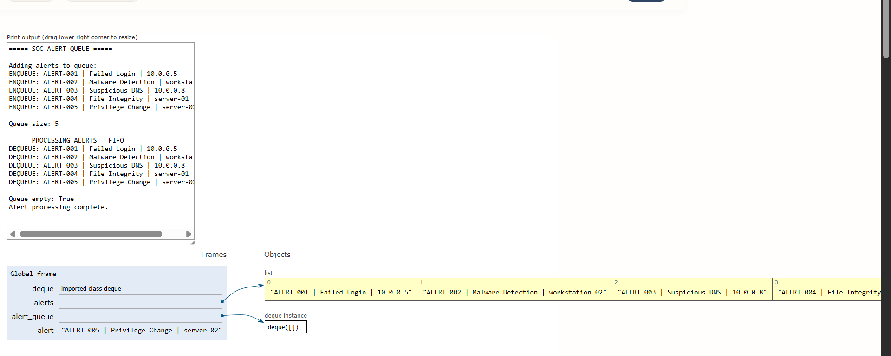

# Day 05 - SOC Alert Processing Queue

> A defensive cybersecurity learning project demonstrating Queue data structures and FIFO alert processing.

[](https://www.python.org/)
[-blue)](#dsa-concept-queue)
[](#cybersecurity-use-case)
[](#day-05-status)

---

## Overview

In defensive cybersecurity operations, Security Operations Center (SOC) environments and incident response systems continually ingest massive volumes of streaming event telemetry and security alerts. This project explores how fundamental Data Structures and Algorithms (DSA)—specifically the **Queue**—can model sequential, chronological event ingestion and processing workflows.

A **Queue** is a linear data structure that adheres strictly to the **FIFO (First In, First Out)** principle. In this educational project, security alerts are ingested from a log source, enqueued sequentially into a queue, and then dequeued in the exact order they arrived so that the oldest alerts are evaluated first.

> [!NOTE]
> This project is an educational model designed to illustrate Queue mechanics and FIFO behavior using security concepts. Real-world enterprise SOC platforms and SIEM engines typically incorporate multi-tier priority queues, risk scoring, threat intelligence enrichment, and distributed streaming architectures rather than a single raw FIFO queue.

---

## Objectives

- **Learn Queue:** Understand the core concepts, internal mechanics, and structural constraints of the Queue data structure.
- **Understand FIFO:** Master the First In, First Out operational paradigm.
- **Implement ENQUEUE:** Apply queue insertion using Python's `collections.deque.append()`.
- **Implement DEQUEUE:** Apply queue removal using Python's `collections.deque.popleft()`.
- **Process Security Alerts in Arrival Order:** Ingest, parse, and process synthetic defensive security events line-by-line while preserving chronological order.
- **Connect DSA with Cybersecurity Workflows:** Understand how queue mechanics apply to security scenarios such as telemetry ingestion pipelines, asynchronous log processing, and event stream buffers.

---

## Cybersecurity Use Case

In modern security telemetry pipelines and SIEM architectures, Queue-based event processing models situations where events should be handled in arrival order:

- **Security Event Ingestion:** As security agents and network sensors emit telemetry (syslog, NetFlow, Windows Event Logs), events are buffered in ingestion queues before being parsed.
- **Log Processing Pipelines:** Security pipeline workers consume batches of raw log records in chronological order to maintain temporal consistency across event timelines.
- **Alert Pipelines:** Alerts generated by detection engines enter processing pipelines where initial triage, automated deduplication, or initial classification occurs sequentially.
- **Asynchronous Processing Concepts:** Decoupling event producers (e.g., firewall collectors, IDS daemons) from alert consumers (e.g., analysis workers, ticketing bridges) requires a FIFO buffer to absorb traffic spikes without dropping packets.
- **Security Telemetry Workflows:** Real-time threat detection rules often require event streams to arrive in order to accurately reconstruct attack stages and sequences.

> [!IMPORTANT]
> This is a simplified educational model focusing on pure FIFO order. Advanced production SOC pipelines layer priority queuing and correlation on top of basic queue mechanisms.

---

## DSA Concept: Queue

A **Queue** is an ordered collection of elements characterized by two primary operations:
- **ENQUEUE:** Adds an element to the rear (tail) of the collection.
- **DEQUEUE:** Removes and retrieves the element from the front (head) of the collection.

### FIFO Principle (First In, First Out)

The element that enters the queue first is always the first one to be removed.

Suppose alerts arrive in this sequence:
```text
ALERT-001
ALERT-002
ALERT-003
ALERT-004
```

When processed from the queue:
```text
DEQUEUE → ALERT-001  (Oldest alert processed first)
DEQUEUE → ALERT-002
DEQUEUE → ALERT-003
DEQUEUE → ALERT-004  (Newest alert processed last)
```

### Python Implementation: `append()` and `popleft()`

In standard Python:
- `alert_queue.append(alert)` $\rightarrow$ **ENQUEUE** (adds item to the rear)
- `alert_queue.popleft()` $\rightarrow$ **DEQUEUE** (removes item from the front)

### Why `deque` Instead of a Standard `list`?

In Python, a standard dynamic array (`list`) allows inserting at the end in $O(1)$ time, but removing from index 0 (`list.pop(0)`) requires shifting every remaining element in memory by one position to the left, which takes **$O(n)$ time**. For large datasets, repeatedly using `list.pop(0)` yields quadratic $O(n^2)$ overall runtime.

In contrast, Python's `collections.deque` (double-ended queue) is implemented internally as a doubly linked list of fixed-size blocks. Both appending to the right (`append()`) and popping from the left (`popleft()`) execute in **$O(1)$ constant time**, making `deque` the optimal standard library structure for implementing a FIFO queue.

---

## Queue Visualization

```text
FRONT                                                  REAR
  ↓                                                      ↓
┌──────────────┬──────────────┬──────────────┬──────────────┐
│  ALERT-001   │  ALERT-002   │  ALERT-003   │  ALERT-004   │
└──────────────┴──────────────┴──────────────┴──────────────┘
       ↑                                             ↑
    DEQUEUE                                       ENQUEUE
 (Removes Front)                                (Adds to Rear)
```

- New alerts enter at the **REAR** via `append()` (**ENQUEUE**).
- Oldest alerts exit from the **FRONT** via `popleft()` (**DEQUEUE**).
- Relative chronological order is strictly preserved.

---

## Processing Flow

```text
alerts.txt
    ↓
Read alert
    ↓
Validate
    ↓
ENQUEUE
    ↓
Queue
    ↓
DEQUEUE
    ↓
Process oldest alert
    ↓
Repeat until empty
```

---

## Alert Format

Alerts are formatted as pipe-delimited records:

```text
ALERT-ID | ALERT-TYPE | SOURCE
```

### Example

```text
ALERT-001 | Failed Login | 10.0.0.5
```

### Field Definitions

- **`ALERT-ID`:** A unique, sequential identifier for the security event (e.g., `ALERT-001` through `ALERT-176`).
- **`ALERT-TYPE`:** The defensive classification or detection category (e.g., `Failed Login`, `Malware Detection`, `Suspicious DNS`, `Privilege Change`).
- **`SOURCE`:** The origin entity triggering the alert, such as an internal RFC 1918 IP address (`10.0.0.x`, `192.168.1.x`) or host system (`workstation-01`–`06`, `server-01`–`04`).

---

## Dataset

The dataset in `alerts.txt` contains 176 synthetic SOC alerts generated for defensive cybersecurity education:

- **Synthetic Data:** Strictly synthetic events; no live, proprietary, or sensitive customer data.
- **Sequential Alert IDs:** Sequentially numbered from `ALERT-001` to `ALERT-176`.
- **Multiple Alert Types:** Realistic defensive SOC categories including:
  - Failed Login
  - Malware Detection
  - Suspicious DNS
  - File Integrity
  - Privilege Change
  - Endpoint Detection
  - Account Change
  - Configuration Change
  - Unusual Authentication
  - Security Policy Violation
  - Suspicious Process
  - Network Anomaly
- **Multiple Sources:** Private RFC 1918 IP addresses (`10.0.0.x`, `192.168.1.x`) and standard host naming conventions (`workstation-01`–`06`, `server-01`–`04`).
- **No Real Security Data:** Contains no real credentials, external IPs, or confidential data.

---

## Project Structure

```text
day-05-soc-alert-queue/
├── main.py
├── alerts.txt
├── alert_queue.png
└── README.md
```

- **`main.py`:** Production Python script implementing file ingestion, defensive parsing, `deque` ENQUEUE, and FIFO DEQUEUE processing.
- **`alerts.txt`:** Synthetic dataset containing 176 security alert records.
- **`alert_queue.png`:** Python Tutor visualization screenshot demonstrating queue state transitions.
- **`README.md`:** Comprehensive technical documentation.

---

## How It Works

1. **Open `alerts.txt`:** The script safely opens `alerts.txt` using a context manager (`with open(...)`).
2. **Read Alerts Sequentially:** The file is streamed line by line.
3. **Ignore Empty Lines:** Blank lines or trailing whitespace are stripped and skipped.
4. **Validate Basic Format:** Defensive checks verify that each line contains the expected three pipe-delimited fields (`ALERT-ID`, `ALERT-TYPE`, `SOURCE`).
5. **ENQUEUE Each Alert:** Validated alerts are appended to the rear of the queue via `alert_queue.append(alert)`.
6. **Maintain FIFO Ordering:** The arrival sequence in the queue matches the input file sequence.
7. **DEQUEUE the Oldest Alert:** Alerts are popped from the front one by one using `alert_queue.popleft()`.
8. **Process It:** The terminal displays each dequeued alert in chronological order.
9. **Continue Until Queue Is Empty:** The `while alert_queue:` loop runs until all elements have been processed and queue size is 0.

---

## Example

Consider an example input sequence:

```text
Input (in alerts.txt):
ALERT-001 | Failed Login | 10.0.0.5
ALERT-002 | Malware Detection | workstation-02
ALERT-003 | Suspicious DNS | 10.0.0.8
```

Processing order demonstrates strict FIFO:

```text
Processing:
[DEQUEUE] ALERT-001 | Failed Login | 10.0.0.5          (Enqueued first, dequeued first)
[DEQUEUE] ALERT-002 | Malware Detection | workstation-02
[DEQUEUE] ALERT-003 | Suspicious DNS | 10.0.0.8        (Enqueued last, dequeued last)
```

---

## Complexity Analysis

Let $n$ denote the total number of alerts ingested:

| Operation | Time Complexity | Details |
| :--- | :--- | :--- |
| **ENQUEUE (`append`)** | $O(1)$ | Adding an element to the rear of a `collections.deque` runs in constant time. |
| **DEQUEUE (`popleft`)** | $O(1)$ | Removing an element from the front of a `collections.deque` runs in constant time without element shifting. |
| **Loading $n$ Alerts** | $O(n)$ | Ingesting $n$ lines sequentially and performing $n$ enqueue operations. |
| **Processing $n$ Alerts** | $O(n)$ | Dequeueing all $n$ alerts until the queue is empty requires $n$ constant-time operations. |
| **Overall Time** | $O(n)$ | Linear scaling directly proportional to the total number of alerts. |
| **Space Complexity** | $O(n)$ | The queue retains $n$ alert strings in memory before processing begins. |

Unlike standard Python lists where `pop(0)` takes $O(n)$ due to memory shifts, `collections.deque` provides true $O(1)$ performance for both ends.

---

## Python Tutor Visualization

Python Tutor was used to visually trace and understand the execution flow and memory layout of the Queue data structure:

- **ENQUEUE:** Tracing `alert_queue.append(alert)` adding elements sequentially to the rear of the queue.
- **DEQUEUE:** Tracing `alert_queue.popleft()` extracting the front element while leaving subsequent elements undisturbed.
- **FRONT & REAR Pointers:** Tracking the dynamic head and tail positions during ingestion and consumption.
- **FIFO Behavior:** Observing that `ALERT-001` (first enqueued) is the first element dequeued and processed.
- **Queue Size Transitions:** Watching the queue expand dynamically during loading and steadily decrease to zero during processing.



---

## How to Run

### Requirements
- Python 3.x (standard library only; no external dependencies)

### Execution

Run the script directly from the project directory:

```bash
python main.py
```

Alternatively, run from the repository root:

```bash
python day-05-soc-alert-queue/main.py
```

---

## Learning Outcome

### DSA
- **Queue Fundamentals:** Linear FIFO structure constraints and operation semantics.
- **FIFO Principles:** First-In, First-Out lifecycle management.
- **ENQUEUE & DEQUEUE Operations:** Using `append()` and `popleft()`.
- **`collections.deque` Efficiency:** Understanding why double-ended queues offer $O(1)$ operations compared to $O(n)$ for list shifts.
- **Algorithmic Complexity:** Analyzing time and memory scaling for queue-based systems.

### Cybersecurity
- **Security Alert Ingestion:** How event streams enter security monitoring pipelines.
- **Event Processing:** Managing alert volumes systematically in arrival order.
- **FIFO Telemetry Handling:** Preserving chronological timelines for accurate forensic reconstruction.
- **Security Pipeline Concepts:** Fundamentals of buffering, worker decoupling, and pipeline throughput.

---

## Limitations

This project is an educational DSA demonstration and is explicitly NOT:
- A production-ready SIEM platform.
- A real-time SOC monitoring console.
- An alert-priority scoring engine (all alerts are treated equally regardless of severity).
- A distributed, persistent message broker (e.g., Apache Kafka, RabbitMQ).
- An automated threat detection or correlation engine.

---

## Future Improvements

Possible architectural extensions for future iterations:
- **Priority Queuing:** Introducing heap-based priority queues to process Critical/High alerts ahead of Low/Informational events.
- **Persistent Queues:** Backing the queue with disk persistence or a database to prevent data loss on process crashes.
- **Asynchronous Workers:** Implementing multi-threaded or `asyncio` consumers to process dequeued alerts concurrently.
- **Message Brokers:** Transitioning from in-memory queues to message brokers for distributed horizontal scaling.
- **Alert Metadata & Correlation:** Enriching alerts with threat intelligence feeds and IP reputation data during dequeue.
- **Queue Monitoring & Metrics:** Tracking queue depth, ingestion rates, and processing latency over time.
- **SIEM Integration:** Forwarding processed alerts into Elasticsearch, Splunk, or OpenSearch.

---

## Security Disclaimer

All security alerts, IP addresses, hostnames, and detection types within this project are entirely synthetic and created solely for defensive cybersecurity education and data structures practice. No real-world, proprietary, or unauthorized security data was used.

---

## Day 05 Status

- [x] Synthetic SOC alert dataset
- [x] File-based alert ingestion
- [x] Queue implementation
- [x] ENQUEUE operation
- [x] DEQUEUE operation
- [x] FIFO processing
- [x] Python Tutor visualization
- [x] Documentation

---

## Author

**Aryan Singh**  
Cybersecurity learner focused on:
- Python
- DSA
- SOC
- Security Engineering
