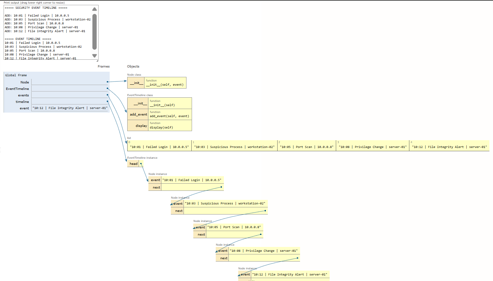

# Day 06 - Security Event Timeline

> A defensive cybersecurity learning project demonstrating Singly Linked Lists and chronological security event tracking.

[](https://www.python.org/)
[](#dsa-concept-linked-list)
[](#cybersecurity-use-case)
[](#status)

---

## Overview

In digital forensics and incident response (DFIR), security analysts frequently reconstruct security incident narratives by assembling security events into a strict chronological timeline. This project implements an educational **Security Event Timeline** engine powered by a custom, hand-crafted **Singly Linked List** data structure.

Rather than relying on built-in collections or high-level database abstractions, this project implements low-level pointer-based node linking in Python. Each security event record is stored within an individual `Node`, sequentially linked through a `next` pointer originating from a `head` reference. The program ingests synthetic security telemetry, validates record integrity, appends events dynamically to the list, and traverses the chain to display the chronological sequence and operational metrics.

---

## Objectives

This project is designed to teach and demonstrate foundational Data Structures and Algorithms (DSA) principles applied to security operations:

- **Linked List Data Structure:** Master dynamic pointer-based sequential data structures without relying on contiguous array allocation.
- **Node Structure:** Understand how to bundle domain data (`event`) and a link reference (`next`) within an atomic object.
- **Head Pointer Management:** Track the entry point of the linked chain and handle boundary conditions (empty list initialization).
- **Next Pointer Chaining:** Establish and manipulate forward references linking discrete nodes across memory.
- **Linked List Traversal:** Implement sequential iteration by following pointer hops (`current = current.next`) until reaching the terminating sentinel (`None`).
- **Dynamic Sequential Storage:** Manage chronological event sequences that grow organically as new security observations arrive.

---

## Cybersecurity Use Case

Security incident response requires reconstructing the exact sequence of adversarial activity across an enterprise environment. Representing security telemetry as a chronological event stream allows analysts to trace lateral movement, privilege escalation, and exfiltration attempts:

- **Authentication Events:** Tracking failed logins followed by sudden successful authentications (`Failed Login` $\rightarrow$ `Successful Login`).
- **Endpoint Detection & Alerting:** Correlating anomalous parent-child execution chains (`Suspicious Process`, `Endpoint Detection`).
- **Privilege Changes:** Identifying unauthorized role modifications or elevation of privileges (`Privilege Change`, `Account Change`).
- **File Integrity Events:** Detecting unauthorized modification or tampering of sensitive binary and configuration files (`File Integrity Alert`).
- **Network Alerts:** Mapping reconnaissance sweeps and command-and-control communication (`Port Scan Detected`, `Suspicious DNS Request`).

> [!NOTE]
> This project serves as an educational model designed to illustrate the structural mechanics of linked lists, node pointers, and sequential traversal using security concepts. Real-world enterprise Security Operations Center (SOC) platforms, Security Information and Event Management (SIEM) systems, and log aggregation engines (e.g., Elasticsearch, ClickHouse, Splunk) rely on columnar storage, inverted indices, distributed streaming message buses, and relational time-series databases rather than standalone singly linked lists.

---

## DSA Concept: Linked List

A **Singly Linked List** is a linear collection of data elements called **Nodes**, where linear order is not dictated by physical memory placement, but by explicit pointers connecting each node to the subsequent one.

- **Node:** The fundamental building block, containing the payload (`event`) and a pointer (`next`).
- **Head:** A pointer variable referencing the first node of the list. If `head is None`, the list is empty.
- **Next:** A reference attribute stored in each node that points to the successor node in the sequence.
- **Traversal:** The process of stepping sequentially through each node starting at `head` and following `next` pointers until `current is None`.

### ASCII Architecture Diagram

```text
HEAD
 |
 v
┌──────────────────┬──────┐
│ Event 1          │ next │───┐
└──────────────────┴──────┘   │
                              v
                       ┌──────────────────┬──────┐
                       │ Event 2          │ next │───┐
                       └──────────────────┴──────┘   │
                                                     v
                                              ┌──────────────────┬──────┐
                                              │ Event 3          │ next │───┐
                                              └──────────────────┴──────┘   │
                                                                            v
                                                                          None
```

---

## Processing Flow

The program follows a clean, sequential data ingestion and traversal lifecycle:

```text
events.txt
    ↓
Read events
    ↓
Validate format & filter malformed lines
    ↓
Create Node
    ↓
Append to Linked List (Head / Next Traversal)
    ↓
Traverse list (current = current.next)
    ↓
Display timeline & output metrics
```

---

## Event Format

Security events are stored as clean, pipe-delimited records matching standard log formatting:

```text
TIME | EVENT TYPE | SOURCE
```

### Format Fields
1. **TIME:** Timestamp in 24-hour format (`HH:MM`).
2. **EVENT TYPE:** Categorical security event classification (e.g., `Failed Login`, `Privilege Change`, `Port Scan Detected`).
3. **SOURCE:** Originating internal IP address, hostname, or network asset (e.g., `10.0.0.5`, `workstation-02`, `server-01`).

### Representative Record Examples
```text
08:02 | Failed Login | 192.168.1.50
08:05 | Port Scan Detected | 10.0.0.45
08:07 | Configuration Change | endpoint-01
08:09 | Account Change | workstation-02
```

---

## Dataset

The dataset in `events.txt` consists of **180 valid synthetic security events** plus intentional malformed and empty lines to test defensive input validation.

- **Private / Synthetic IP Ranges:** RFC 1918 addresses (`10.0.0.x`, `192.168.1.x`, `172.16.x.x`).
- **Synthetic Hostnames:** `workstation-01`, `workstation-02`, `workstation-03`, `server-01`, `server-02`, `endpoint-01`, `gateway-01`.
- **Educational Context:** All data is synthetically generated for educational practice. No production credentials, real malicious infrastructure, or private network telemetry are included.

---

## Project Structure

```text
day-06-security-event-timeline/
├── main.py
├── events.txt
├── event_timeline.png
└── README.md
```

- **`main.py`:** Core Python application implementing the custom `Node` and `EventTimeline` classes, file ingestion, defensive validation, and traversal.
- **`events.txt`:** Synthetic security event log containing chronological records and test malformed lines.
- **`event_timeline.png`:** Memory frame visualization from Python Tutor illustrating node allocation and pointer linking.
- **`README.md`:** Comprehensive architectural documentation, complexity analysis, and educational walkthrough.

---

## How It Works

The program explicitly defines two custom classes without leveraging high-level Python collections:

### 1. `Node` Class
```python
class Node:
    def __init__(self, event):
        self.event = event
        self.next = None
```
- Holds the raw `event` string payload.
- Initializes `self.next` to `None`, indicating that the newly created node does not yet link to any subsequent node.

### 2. `EventTimeline` Class
```python
class EventTimeline:
    def __init__(self):
        self.head = None

    def add_event(self, event):
        new_node = Node(event)
        if self.head is None:
            self.head = new_node
            return

        current = self.head
        while current.next is not None:
            current = current.next

        current.next = new_node

    def display(self):
        current = self.head
        count = 0
        while current is not None:
            print(current.event)
            current = current.next
            count += 1
        return count

    def is_empty(self):
        return self.head is None
```

- **Initialization:** Sets `self.head = None`, establishing an initially empty list.
- **`add_event()`:**
  - If `self.head` is `None`, the new node directly becomes the list's `head`.
  - Otherwise, the method begins at `self.head` and walks node-by-node using `current = current.next` until it reaches the final node whose `current.next is None`.
  - It sets `current.next = new_node`, appending the event to the tail.
- **`display()`:** Traverses the entire chain from `head` through each `next` pointer until `current` is `None`, printing each event in chronological order and tracking the total count.
- **`is_empty()`:** Returns `True` if `head` is `None`, `False` otherwise.

---

## Example Output

When executing `python main.py`, the application outputs:

```text
===== SECURITY EVENT TIMELINE =====

Events loaded: 180
Events stored: 180
Valid events: 180
Skipped invalid lines: 2

===== TIMELINE =====

08:02 | Failed Login | 192.168.1.50
08:05 | Port Scan Detected | 10.0.0.45
08:07 | Configuration Change | endpoint-01
08:09 | Account Change | workstation-02
08:11 | Failed Login | 10.0.0.14
08:14 | Port Scan Detected | server-02
08:16 | Unusual Authentication | 192.168.1.15
...
18:05 | Suspicious DNS Request | 192.168.1.25
18:08 | Configuration Change | 10.0.0.5
18:10 | Endpoint Detection | workstation-02
18:13 | Suspicious Process | server-02

===== SUMMARY =====

Total events: 180
Timeline traversal complete.
Linked list empty: False
```

---

## Complexity Analysis

| Operation | Time Complexity | Space Complexity | Explanation |
| :--- | :---: | :---: | :--- |
| **Append to End (with traversal)** | $\mathcal{O}(n)$ | $\mathcal{O}(1)$ auxiliary | Must traverse from `head` across $n$ nodes to locate the final node before linking. |
| **Traversal / Display** | $\mathcal{O}(n)$ | $\mathcal{O}(1)$ auxiliary | Visits every node in the list exactly once from `head` to `None`. |
| **Search / Lookup** | $\mathcal{O}(n)$ | $\mathcal{O}(1)$ auxiliary | Requires linear pointer traversal since linked lists lack random indexed access. |
| **Total Memory Footprint** | — | $\mathcal{O}(n)$ | Allocates $n$ distinct `Node` instances, each storing data and a reference pointer. |

> [!TIP]
> **Tail Pointer Optimization:**
> Maintaining an additional `tail` reference pointer in `EventTimeline` would reduce the append operation from $\mathcal{O}(n)$ to $\mathcal{O}(1)$ constant time by directly performing `self.tail.next = new_node; self.tail = new_node`.
> However, this educational implementation deliberately omits the tail pointer to explicitly illustrate the mechanics of pointer traversal from `head` through `current.next`.

---

## Python Tutor Visualization

The screenshot below illustrates the Python Tutor runtime memory structure during execution of the educational implementation:



### Visualization Breakdown
- **Global Frame:** Contains class definitions for `Node` and `EventTimeline`, along with the `timeline` instance variable.
- **`EventTimeline` Instance:** Displays the `head` pointer pointing directly to the first `Node` instance in memory.
- **Node Instances:** Shows the sequential chain of `Node` objects. Each node contains:
  - `event`: String value storing the timestamp, event type, and source host (e.g., `"10:01 | Failed Login | 10.0.0.5"`).
  - `next`: Pointer referencing the subsequent `Node` instance in the sequence, culminating in `None` at the tail.

---

## How to Run

Clone the repository and run the script with Python 3:

```bash
# Navigate to the Day 06 directory
cd day-06-security-event-timeline

# Run the timeline application
python main.py
```

The script can also be executed directly from the repository root:

```bash
python day-06-security-event-timeline/main.py
```

---

## Learning Outcome

Through this project, key engineering and computer science takeaways were reinforced:
- **Low-Level Memory Linking:** Mastered how individual heap-allocated objects can be stitched into coherent linear structures without contiguous array memory.
- **Pointer Manipulation & Boundary Cases:** Gained hands-on experience handling edge cases: empty lists (`head is None`), single-node lists, and multi-node chains.
- **Security Timeline Modeling:** Understood how temporal forensic chains map naturally to sequential pointer-linked data structures.
- **Algorithmic Tradeoffs:** Recognized the performance characteristics of singly linked lists, specifically why end-appends without a tail pointer require $\mathcal{O}(n)$ traversal, while prepending would take $\mathcal{O}(1)$.

---

## Limitations

- **Educational Scope:** Built strictly for pedagogical clarity rather than high-throughput production ingestion.
- **No Persistent Database:** Events are stored strictly in volatile process memory during execution.
- **No Real-Time Streaming:** Operates in batch mode over a static flat file rather than consuming from live Kafka/Syslog streams.
- **No Advanced Indexing:** Searching or filtering by IP or alert type requires $\mathcal{O}(n)$ linear scans; there are no hash indices or B-trees.
- **No Distributed Processing:** Does not support distributed clustering or concurrent multi-threaded ingestion.
- **Python Practicality:** In real-world Python development, native dynamic arrays (`list`) and double-ended queues (`collections.deque`) are implemented in highly optimized C and offer superior cache locality and lower per-node pointer overhead.

---

## Future Improvements

- [ ] **Tail Pointer Integration:** Add a `tail` pointer to achieve $\mathcal{O}(1)$ constant-time appending.
- [ ] **Structured Timestamps:** Parse raw strings into Python `datetime` objects for time-delta calculations and windowing.
- [ ] **Severity Classification:** Incorporate numeric risk scoring (Low, Medium, High, Critical) into node attributes.
- [ ] **Search & Filtering:** Implement search methods to filter nodes by event type, source IP, or time range.
- [ ] **Node Deletion:** Implement node deletion by event ID or criteria to model log grooming.
- [ ] **Bidirectional Traversal:** Upgrade to a Doubly Linked List (`prev` and `next` pointers) to allow forensic timeline scrubbing both forward and backward.
- [ ] **Live Telemetry Pipeline:** Connect ingestion logic to an active Syslog listener or mock event generator in a controlled security lab.

---

## Security Disclaimer

All security events, IP addresses, timestamps, hostnames, and detection names in this repository are **100% synthetic** and designed exclusively for educational cybersecurity exercises. No real-world networks, production infrastructure, sensitive credentials, or malicious domains were used.

---

## Status

**Day 06 of the 30-Day Cybersecurity DSA Project Sprint** — Completed.

---

## Author

**Aryan Singh**
