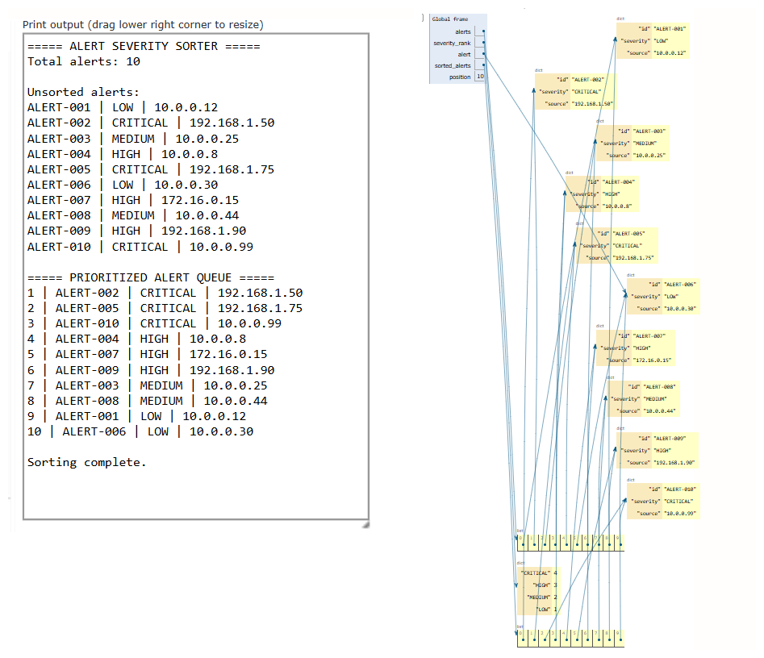

# Day 07 - Alert Severity Sorter

> A defensive cybersecurity learning project demonstrating Sorting algorithms and Security Alert Prioritization in a Security Operations Center (SOC).

[](https://www.python.org/)
[](#dsa-concept-sorting)
[](#cybersecurity-use-case)
[](#status)

---

## Overview

In modern enterprise security operations, security monitoring tools—such as Security Information and Event Management (SIEM), Endpoint Detection and Response (EDR), and Network Intrusion Detection Systems (NIDS)—generate thousands of alerts per hour. If a Security Operations Center (SOC) processes alerts purely in chronological First-In, First-Out (FIFO) arrival order, critical threats like active ransomware encryption or command-and-control beacons can remain trapped behind hundreds of benign or low-priority notifications.

This project implements an educational **Alert Severity Sorter** utility in Python. It reads raw, unsorted alert telemetry from a flat text file, defensively parses and validates each record, translates qualitative alert severity levels into ordinal numeric priorities, and sorts the alerts in descending order of severity. This ensures that Level 1 (L1) and Level 2 (L2) SOC analysts immediately triage the most dangerous, high-impact events first.

---

## Cybersecurity Use Case

Security alert prioritization directly governs a SOC's efficiency, triage speed, and SLA compliance:

- **Mitigating Alert Fatigue:** Security analysts face hundreds of informational alerts daily. Prioritizing critical alerts prevents analyst burnout on low-impact events while active intrusions unfold.
- **Reducing Mean Time to Detect (MTTD) & Respond (MTTR):** Immediately directing analyst attention to `CRITICAL` and `HIGH` severity incidents ensures that containment measures (e.g., host isolation, credential revocation) happen before data exfiltration occurs.
- **Defensive Triage Scheduling:** Triage queues require dynamic restructuring so high-priority alerts jump ahead of routine telemetry regardless of arrival time.
- **Correlating Multi-Event Hosts:** Identifying repeated internal IP addresses across multiple severity tiers (e.g., an endpoint producing both `LOW` port probes and `CRITICAL` privilege escalation) helps spot targeted attack campaigns.

> [!NOTE]
> In real-world enterprise SOC environments, alert queues are ingested via distributed message buses (e.g., Apache Kafka) and sorted dynamically using Priority Queues (Min/Max Heaps) or indexing engines (e.g., Elasticsearch, OpenSearch). This educational project demonstrates the fundamental algorithmic transformation: applying sorting keys to prioritize unstructured security telemetry.

---

## DSA Concept: Sorting

**Sorting** is the algorithmic process of rearranging an unordered collection of elements into a specific monotonic order (ascending or descending) based on a defined comparison key.

Key principles applied in this project:

- **Key-Based Transformation:** Security alerts are non-numeric domain objects (dictionaries with strings). Sorting them requires extracting a measurable attribute—here, mapping severity text to an ordinal integer weight (`CRITICAL` = 4, `HIGH` = 3, `MEDIUM` = 2, `LOW` = 1).
- **Stability:** A stable sorting algorithm preserves the relative input order of records that have equal comparison keys. In SOC triage, if two `CRITICAL` alerts arrive, preserving their arrival order ensures fairness and chronological consistency within the same severity tier.
- **Python's Underlying Algorithm (Timsort):** Python's built-in `sorted()` function implements **Timsort**, a hybrid, adaptive, stable sorting algorithm derived from Merge Sort and Insertion Sort.

---

## Why Sorting Matters in a SOC

Consider a SOC team managing incoming incidents during peak business hours:

```text
FIFO (Chronological) Queue Arrival:
[Arrival 1: LOW] -> [Arrival 2: LOW] -> [Arrival 3: LOW] -> ... -> [Arrival 50: CRITICAL]
```

Under strict FIFO processing, the analyst must investigate 49 low-severity events before even opening the `CRITICAL` breach notification. By the time they reach Alert 50, the adversary may have completed lateral movement and exfiltrated sensitive databases.

```text
Sorted (Prioritized) Queue:
[Rank 1: CRITICAL] -> [Rank 2: CRITICAL] -> [Rank 3: HIGH] -> ... -> [Rank 50: LOW]
```

Sorting reorganizes the workload strictly by business impact and operational risk, ensuring that critical incidents receive immediate containment within strict Service Level Agreements (SLAs).

---

## Input Format

The dataset is ingested from `alerts.txt`. Each record represents a single security telemetry event formatted with whitespace-delimited key-value attributes:

```text
ALERT-ID severity=SEVERITY_LEVEL source=SOURCE_IP
```

### Parsing Rules & Defensive Measures
1. **Empty Lines:** Blank lines or trailing whitespace are ignored without error.
2. **Key-Value Splitting:** Fields `severity=` and `source=` are explicitly extracted, accommodating potential attribute reordering.
3. **Case Normalization:** Severity strings are converted to uppercase (`upper()`) to normalize inputs like `critical` or `Critical`.
4. **Malformed Lines:** Records missing mandatory fields, having fewer than three tokens, or containing unrecognized severity values (e.g., `UNKNOWN`) are safely detected and skipped with a warning message, preventing script crashes.

---

## Detection / Prioritization Logic

The system establishes an ordinal priority dictionary mapping each qualitative severity classification to a discrete numerical weight:

```python
SEVERITY_RANK = {
    "CRITICAL": 4,
    "HIGH":     3,
    "MEDIUM":   2,
    "LOW":      1
}
```

During sorting, each alert's severity string is looked up in `SEVERITY_RANK`, producing a numeric key. The sorting routine orders the collection in descending sequence (`reverse=True`), placing weight 4 (`CRITICAL`) at position 1 and weight 1 (`LOW`) at the end.

---

## Severity Ranking

| Severity | Priority Weight | Typical SOC Scenario | Operational Response SLA |
| :--- | :---: | :--- | :--- |
| **CRITICAL** | **4** | Active ransomware, Domain Controller compromise, remote code execution (RCE), confirmed data exfiltration. | Immediate triage (< 15 mins); host isolation; incident commander engaged. |
| **HIGH** | **3** | Credential dumping, lateral movement attempt, unauthorized admin account creation, abnormal beaconing. | High-priority triage (< 1 hour); containment and account reset. |
| **MEDIUM** | **2** | Suspicious PowerShell execution, policy violation, brute force attempt against external gateway. | Standard triage (< 4 hours); scope validation. |
| **LOW** | **1** | Routine port scanning, minor certificate expiration warnings, informational vulnerability scan notices. | Low-priority / batched review (< 24 hours); baseline logging. |

---

## Processing Flow

```text
       alerts.txt (Unsorted Raw Telemetry)
                       │
                       ▼
            load_alerts() Ingestion
                       │
         ┌─────────────┴─────────────┐
         ▼                           ▼
[Valid Records]            [Malformed / Empty Lines]
  Parse attributes           Safely skip & log warning
         │
         ▼
[alerts] Python List of Dictionaries
         │
         ▼
Print Original Alert Order
         │
         ▼
sorted(alerts, key=SEVERITY_RANK, reverse=True)
         │
         ▼
[sorted_alerts] Prioritized List of References
         │
         ▼
Display Prioritized Alert Queue with Ranks (1 to N)
         │
         ▼
Print Completion Message
```

---

## Example Input

Snippet from `alerts.txt`:

```text
ALERT-001 severity=LOW source=10.0.0.12
ALERT-002 severity=CRITICAL source=192.168.1.50
ALERT-003 severity=MEDIUM source=10.0.0.25
ALERT-004 severity=HIGH source=10.0.0.8
ALERT-005 severity=CRITICAL source=192.168.1.75
ALERT-006 severity=LOW source=10.0.0.30
MALFORMED_RECORD_MISSING_SEVERITY_AND_SOURCE
ALERT-007 severity=HIGH source=172.16.0.15
ALERT-008 severity=MEDIUM source=10.0.0.44

ALERT-009 severity=HIGH source=192.168.1.90
ALERT-010 severity=CRITICAL source=10.0.0.99
ALERT-013 severity=UNKNOWN source=10.0.0.80
ALERT-014 severity=CRITICAL source=192.168.1.50
ALERT-018 severity=CRITICAL source=10.0.0.12
```

---

## Example Output

Running `python main.py` produces:

```text
===== ALERT SEVERITY SORTER =====
[WARN] Skipping malformed alert line: MALFORMED_RECORD_MISSING_SEVERITY_AND_SOURCE
[WARN] Skipping malformed alert line: ALERT-013 severity=UNKNOWN source=10.0.0.80
Total alerts loaded: 17

Original alert order:
ALERT-001 | LOW | 10.0.0.12
ALERT-002 | CRITICAL | 192.168.1.50
ALERT-003 | MEDIUM | 10.0.0.25
ALERT-004 | HIGH | 10.0.0.8
ALERT-005 | CRITICAL | 192.168.1.75
ALERT-006 | LOW | 10.0.0.30
ALERT-007 | HIGH | 172.16.0.15
ALERT-008 | MEDIUM | 10.0.0.44
ALERT-009 | HIGH | 192.168.1.90
ALERT-010 | CRITICAL | 10.0.0.99
ALERT-011 | LOW | 172.16.0.22
ALERT-012 | MEDIUM | 10.0.0.12
ALERT-014 | CRITICAL | 192.168.1.50
ALERT-015 | HIGH | 10.0.0.8
ALERT-016 | MEDIUM | 172.16.0.35
ALERT-017 | LOW | 192.168.1.90
ALERT-018 | CRITICAL | 10.0.0.12

===== PRIORITIZED ALERT QUEUE =====
1 | ALERT-002 | CRITICAL | 192.168.1.50
2 | ALERT-005 | CRITICAL | 192.168.1.75
3 | ALERT-010 | CRITICAL | 10.0.0.99
4 | ALERT-014 | CRITICAL | 192.168.1.50
5 | ALERT-018 | CRITICAL | 10.0.0.12
6 | ALERT-004 | HIGH | 10.0.0.8
7 | ALERT-007 | HIGH | 172.16.0.15
8 | ALERT-009 | HIGH | 192.168.1.90
9 | ALERT-015 | HIGH | 10.0.0.8
10 | ALERT-003 | MEDIUM | 10.0.0.25
11 | ALERT-008 | MEDIUM | 10.0.0.44
12 | ALERT-012 | MEDIUM | 10.0.0.12
13 | ALERT-016 | MEDIUM | 172.16.0.35
14 | ALERT-001 | LOW | 10.0.0.12
15 | ALERT-006 | LOW | 10.0.0.30
16 | ALERT-011 | LOW | 172.16.0.22
17 | ALERT-017 | LOW | 192.168.1.90

Sorting complete. All alerts prioritized successfully.
```

---

## Algorithm Explanation

This project demonstrates the practical **application of sorting** in security engineering rather than implementing an elementary sorting algorithm (such as Bubble Sort or Selection Sort) from scratch.

### Underlying Engine: Timsort
Under the hood, Python's built-in `sorted()` executes **Timsort** (created by Tim Peters in 2002 for CPython):
1. **Adaptive & Hybrid:** Timsort inspects the input data to identify existing natural ordered sequences ("runs"). For small slices or runs shorter than a minimum threshold (`minrun`, typically 32 or 64 elements), it applies an optimized binary **Insertion Sort**.
2. **Merge Strategy:** Longer runs are merged pairwise using a balanced **Merge Sort** technique that respects a strict stack invariant, maintaining optimal memory efficiency and minimizing comparisons.
3. **Stability Guarantee:** Because Timsort is strictly stable, alerts with identical severities (e.g., multiple `CRITICAL` alerts) retain their relative input arrival order. This is vital in SOC triage so that earlier arrivals within the same severity tier are investigated first.
4. **Key Evaluation:** The sorting key is evaluated exactly once per element via the extraction lambda `lambda alert: SEVERITY_RANK[alert["severity"]]`, mapping the text string to its integer weight.

---

## Time Complexity

Let $n$ denote the total number of alerts ingested:

| Phase / Operation | Best Case | Average Case | Worst Case | Technical Explanation |
| :--- | :---: | :---: | :---: | :--- |
| **File Reading & Parsing** | $\mathcal{O}(n)$ | $\mathcal{O}(n)$ | $\mathcal{O}(n)$ | Single linear pass across all lines in `alerts.txt`. |
| **Key Extraction** | $\mathcal{O}(n)$ | $\mathcal{O}(n)$ | $\mathcal{O}(n)$ | Dictionary lookup in `SEVERITY_RANK` is $\mathcal{O}(1)$ per record ($n$ lookups). |
| **Timsort (`sorted()`)** | $\mathcal{O}(n)$ | $\mathcal{O}(n \log n)$ | $\mathcal{O}(n \log n)$ | If data is partially pre-sorted, Timsort approaches linear time $\mathcal{O}(n)$. In the average and worst case, Timsort performs at most $n \lceil\log_2 n\rceil$ comparisons. |
| **Output Traversal** | $\mathcal{O}(n)$ | $\mathcal{O}(n)$ | $\mathcal{O}(n)$ | Linear enumeration to display original and sorted sequences. |
| **Overall Pipeline** | $\mathcal{O}(n)$ | $\mathcal{O}(n \log n)$ | $\mathcal{O}(n \log n)$ | Dominated by the comparison sort phase: $\mathcal{O}(n \log n)$. |

---

## Space Complexity

- **In-Memory Objects:** Storing $n$ alert dictionaries consumes $\mathcal{O}(n)$ heap memory.
- **Sorted Output List:** Unlike `list.sort()` (which sorts in-place and takes $\mathcal{O}(1)$ extra storage for pointers), `sorted()` constructs and returns a **new** list containing references to the existing alert dictionaries, requiring $\mathcal{O}(n)$ auxiliary space.
- **Timsort Temporary Merge Buffer:** Timsort requires a temporary working array to merge runs, bounded by $\mathcal{O}(n)$ (specifically at most $n / 2$ element references).
- **Total Auxiliary Space:** $\mathcal{O}(n)$ linear space complexity.

---

## Python Implementation

The implementation is contained in [`main.py`](main.py):

```python
# Severity priority mapping (CRITICAL = 4, HIGH = 3, MEDIUM = 2, LOW = 1)
SEVERITY_RANK = {
    "CRITICAL": 4,
    "HIGH": 3,
    "MEDIUM": 2,
    "LOW": 1
}

# Sorting alerts by mapped severity rank in descending order
sorted_alerts = sorted(
    alerts,
    key=lambda alert: SEVERITY_RANK[alert["severity"]],
    reverse=True
)
```

### Key Implementation Details
- **Defensive Ingestion:** `parse_alert()` validates line format, extracts key-value pairs safely, and validates severity against known keys before constructing dictionaries.
- **Reference Preservation:** The dictionaries themselves are not duplicated; `sorted_alerts` stores references to the original dictionary instances, reordered by key.
- **Enumeration:** `enumerate(sorted_alerts, start=1)` produces human-readable, 1-indexed queue ranks for SOC analysts.

---

## Python Tutor Visualization

Python Tutor was used to trace the execution flow and observe how Python manages object references, dictionary lookups, and list reordering in memory:

- **Reference-Based Reordering:** The visualization clearly shows that `alerts` and `sorted_alerts` are two distinct list objects containing pointers to the exact same underlying alert dictionary objects on the heap.
- **Key Function Lookup:** During sorting, the key function accesses the `severity_rank` mapping dictionary to extract the numerical score without modifying the dictionary payloads.
- **Global Frame State:** Tracing variables (`alerts`, `sorted_alerts`, `severity_rank`, `position`, `alert`) shows how the prioritized queue is constructed step-by-step.



---

## Project Structure

```text
day-07-alert-severity-sorter/
├── main.py
├── alerts.txt
├── alert_sorter.png
└── README.md
```

- **`main.py`:** Production Python script implementing file ingestion, defensive parsing, Timsort prioritization, and formatted terminal output.
- **`alerts.txt`:** Synthetic dataset containing 18 lines of telemetry (including duplicate IPs, blank lines, and malformed records).
- **`alert_sorter.png`:** Python Tutor visualization screenshot demonstrating runtime memory structures and terminal output.
- **`README.md`:** Comprehensive technical documentation and complexity analysis.

---

## How to Run

### Requirements
- Python 3.x (standard library only; no third-party packages required).

### Execution

Run directly from within the project directory:

```bash
cd day-07-alert-severity-sorter
python main.py
```

Or run directly from the repository root:

```bash
python day-07-alert-severity-sorter/main.py
```

---

## Learning Objectives

- **Applied Sorting in Security:** Connect fundamental sorting theory to solving the real-world cybersecurity challenge of SOC alert fatigue and SLA triage.
- **Key-Based Sorting:** Understand how Python's `key` parameter transforms complex object comparisons into fast numeric evaluations.
- **Timsort Mechanics:** Analyze why Timsort provides $\mathcal{O}(n \log n)$ worst-case guarantees and how its stability preserves chronological arrival within the same severity level.
- **Defensive Telemetry Parsing:** Build resilient ingestion logic that tolerates malformed inputs, missing keys, and unexpected whitespace without terminating execution.
- **Memory References in Python:** Observe through Python Tutor that sorting collections of objects reorders references rather than copying memory buffers.

---

## Limitations

- **Batch vs. Streaming:** This program operates on a static batch file. In live production pipelines, alerts stream continuously and are prioritized in real time using streaming Priority Queues (Heaps) rather than full batch re-sorting.
- **Single-Criteria Sorting:** Alerts are prioritized strictly by severity level. In enterprise operations, secondary tie-breakers (e.g., asset criticality, user privilege, or timestamp age) are factored in.
- **Volatile Storage:** Alerts are parsed and kept in process RAM; there is no persistent storage or database synchronization.
- **No Dynamic Threshold Tuning:** Severity mappings are hardcoded rather than dynamically adjusted based on active threat intelligence feeds or indicator scoring.

---

## Future Improvements

- [ ] **Composite Multi-Key Sorting:** Implement secondary tie-breaking by arrival timestamp (`(severity_weight, -timestamp)`) so older alerts within the same severity are triaged first.
- [ ] **Streaming Priority Queue:** Transition from batch `sorted()` to a Min/Max Heap (`heapq`) to model continuous real-time alert insertion and extraction in $\mathcal{O}(\log n)$ time.
- [ ] **Asset Criticality Weighting:** Combine alert severity with asset importance (e.g., Domain Controller = $\times 2.0$, Test Lab = $\times 0.5$) for composite risk scoring.
- [ ] **JSON / CEF / Syslog Ingestion:** Extend parser to support standard enterprise log formats like Common Event Format (CEF) and structured JSON.
- [ ] **Alert Aggregation:** Group duplicate alerts originating from the same source IP into aggregated incident cases.

---

## Security Disclaimer

All alerts, IP addresses, and telemetry entries in this repository are **100% synthetic** and created strictly for educational cybersecurity and computer science training. No real-world networks, production infrastructure, sensitive credentials, or malicious domains were used.

---

## Status

**Day 07 of the 30-Day Cybersecurity DSA Project Sprint** — Completed.

---

## Author

**Aryan Singh**
