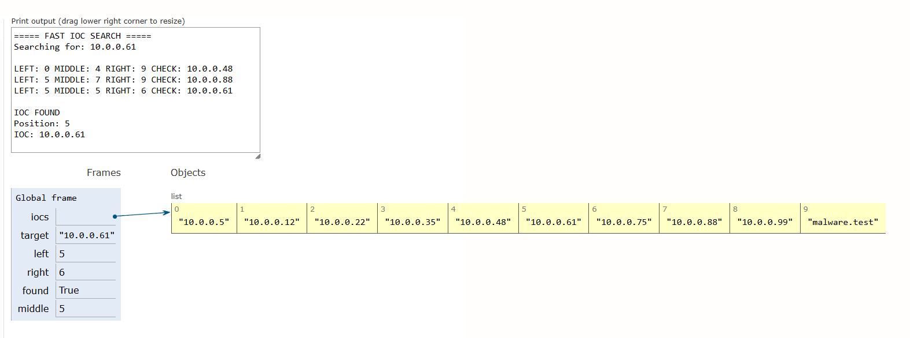

# Day 08 - Fast IOC Search

> A defensive cybersecurity and algorithms project demonstrating explicit Binary Search for ultra-fast indicator of compromise (IOC) lookups across sorted threat intelligence feeds.

[](https://www.python.org/)
[)-blue)](#dsa-concept-binary-search)
[](#cybersecurity-use-case)
[](#day-08-status)

---

## Overview

In security operations, rapid threat detection depends on the ability to query millions of incoming event telemetry records against threat intelligence feeds containing known Indicators of Compromise (IOCs)—such as malicious IP addresses, domain names, and file hashes.

A naive linear search through an unsorted dataset requires examining every record until a match is found ($O(n)$ time complexity), which quickly creates a catastrophic processing bottleneck during high-throughput network monitoring or incident triage.

This project implements an **explicit, from-scratch Binary Search algorithm** in Python to locate IOCs within a sanitized, pre-sorted indicator dataset in logarithmic time ($O(\log n)$). It demonstrates the mechanics of boundary narrowing, index calculation, step-by-step state logging, and defensive file ingestion with malformed record handling.

> [!NOTE]
> **Educational Simulation Notice:** This project uses strictly synthetic, educational indicators (e.g., RFC 1918 private IP blocks `10.0.0.0/8`, `172.16.0.0/12`, `192.168.0.0/16`, `.test` top-level domains, and synthetic hash strings). No live malicious infrastructure or active indicators are used.

---

## Cybersecurity Use Case

Fast indicator matching is foundational across defensive security infrastructure:

- **Threat Intelligence Feeds:** Threat intelligence platforms (TIPs) aggregate feeds from CERTs, commercial vendors, and open-source intelligence (OSINT). Matching local telemetry against static, curated indicator blacklists must execute with minimal latency.
- **SOC Triage & Incident Investigation:** Tier-1 and Tier-2 Security Operations Center (SOC) analysts investigating an alert often query specific host IPs, requested domains, or dropped artifact hashes against known threat databases.
- **Suspicious IP & Domain Lookup:** Web application firewalls (WAF), DNS sinkholes, and egress proxies evaluate inbound and outbound network connections against threat lists to block Command and Control (C2) callback beacons or phishing portals.
- **Security Telemetry Analysis & SIEM Pipelines:** SIEM detection correlation engines ingest tens of thousands of firewall and Sysflow logs every second. Checking each event against reference IOC sets in $O(\log n)$ or $O(1)$ time ensures telemetry pipelines never experience backpressure.

---

## DSA Concept: Binary Search

**Binary Search** is an optimal search algorithm that finds the position of a target value within a **sorted array** by repeatedly dividing the search interval in half.

### Core Mechanics

1. **Sorted Data Requirement:** Binary Search strictly requires the dataset to be in sorted order (lexicographically or numerically). If elements are unsorted, the monotonic order property is broken, and halving the window cannot eliminate candidates reliably.
2. **Left Boundary (`left`):** Points to the lower index of the current active search space (initially `0`).
3. **Right Boundary (`right`):** Points to the upper index of the current active search space (initially `len(iocs) - 1`).
4. **Middle Index (`middle`):** The midpoint between boundaries, calculated via integer division:
   $$\text{middle} = \lfloor \frac{\text{left} + \text{right}}{2} \rfloor$$
5. **Comparison & Search-Space Reduction:**
   - If `iocs[middle] == target`: Target located; return success and index.
   - If `iocs[middle] < target`: The target must lie strictly to the right. Adjust lower bound: `left = middle + 1`.
   - If `iocs[middle] > target`: The target must lie strictly to the left. Adjust upper bound: `right = middle - 1`.
6. **Termination:** The search continues while `left <= right`. If `left > right`, the search window has collapsed, proving the target is not present in the dataset.

---

## Search Visualization

```text
[1]   [2]   [3]   [4]   [5]   [6]   [7]   [8]
 ↑                       ↑                 ↑
LEFT                   MIDDLE            RIGHT

                         ↓
                   Check middle

            target < middle  ?
                   ↓
       Discard right half [5..8]
       New window: [1..4]
       RIGHT = middle - 1

            target > middle  ?
                   ↓
       Discard left half [1..5]
       New window: [6..8]
       LEFT = middle + 1
```

### Trace Example (134 IOCs)

When searching for `10.0.0.61` in a dataset of 134 sorted IOCs:

```text
Initial Array Bounds: [0 .. 133] (Window size = 134)
Step 1: MIDDLE = 66  | CHECK = '192.168.1.205' | '10.0.0.61' < '192.168.1.205' → Go Left  [0 .. 65]
Step 2: MIDDLE = 32  | CHECK = '172.16.1.10'   | '10.0.0.61' < '172.16.1.10'   → Go Left  [0 .. 31]
Step 3: MIDDLE = 15  | CHECK = '10.0.0.222'    | '10.0.0.61' < '10.0.0.222'    → Go Left  [0 .. 14]
Step 4: MIDDLE = 23  | CHECK = '10.0.0.55'     | '10.0.0.61' > '10.0.0.55'     → Go Right [16 .. 31]
Step 5: MIDDLE = 27  | CHECK = '10.0.0.75'     | '10.0.0.61' < '10.0.0.75'     → Go Left  [24 .. 26]
Step 6: MIDDLE = 25  | CHECK = '10.0.0.61'     | MATCH FOUND at index 25!
```

In just **6 comparisons**, Binary Search pinpointed the target among 134 records. A linear search starting from the beginning could require dozens or hundreds of comparisons.

---

## Why Binary Search?

| Metric | Linear Search | Binary Search |
| :--- | :--- | :--- |
| **Best Case** | $O(1)$ (First element) | $O(1)$ (Exact midpoint) |
| **Average Case** | $O(n)$ | $O(\log n)$ |
| **Worst Case** | $O(n)$ | $O(\log n)$ |
| **Space Complexity** | $O(1)$ | $O(1)$ |
| **Precondition** | Unsorted or Sorted | **Strictly Sorted** |

### The Sorting Amortization Trade-Off

- **One-time Sorting Cost:** Sorting an array of $n$ elements using efficient algorithms (like Timsort) takes $O(n \log n)$.
- **Binary Search Cost:** Each lookup takes $O(\log n)$.
- **Linear Search Cost:** Each lookup takes $O(n)$ without sorting.

$$\text{Total Cost}_{\text{Linear for } k \text{ queries}} = k \cdot O(n)$$
$$\text{Total Cost}_{\text{Binary for } k \text{ queries}} = O(n \log n) + k \cdot O(\log n)$$

> [!TIP]
> **When is Binary Search useful?**
> When a threat intelligence dataset is loaded once and queried repeatedly (large $k$ queries against a static or batch-updated IOC list), the $O(n \log n)$ initial sort cost is quickly amortized. For $k \gg 1$, $k \cdot \log_2(n)$ is orders of magnitude faster than $k \cdot n$.

---

## Python Tutor Execution Trace

Below is the verified Python Tutor step-by-step memory frame execution trace showing variable evolution (`left`, `middle`, `right`, `target`, `found`) and search-space halving:



---

## Implementation Details

### File Structure

```text
day-08-fast-ioc-search/
│
├── main.py          # Explicit binary search implementation & test runner
├── iocs.txt         # 134 synthetic IOCs + malformed/empty test lines
├── ioc_search.png   # Python Tutor memory frame trace screenshot
└── README.md        # Comprehensive technical documentation
```

### Defensive Ingestion & Sanitization

In `main.py`, the ingestion pipeline handles malformed lines, comment headers, and whitespace padding safely:

```python
def is_valid_ioc(token: str) -> bool:
    if not token or token.startswith("#"):
        return False
    if any(c.isspace() for c in token):
        return False
    if any(c in token for c in ["[", "]", "{", "}", ":", ";"]):
        return False
    return True
```

### Explicit Binary Search Algorithm

The binary search implementation avoids high-level library shortcuts (`in`, `.index()`, `set`, or database lookups) and explicitly manages boundaries:

```python
def binary_search(iocs: list, target: str):
    left = 0
    right = len(iocs) - 1
    step = 1

    while left <= right:
        middle = (left + right) // 2
        current = iocs[middle]

        print(f"Search step {step}:")
        print(f"LEFT={left}")
        print(f"MIDDLE={middle}")
        print(f"RIGHT={right}")
        print(f"CHECK={current}\n")

        if current == target:
            return True, middle, step
        elif current < target:
            left = middle + 1
        else:
            right = middle - 1

        step += 1

    return False, None, step - 1
```

---

## How to Run

### Run Standard Automated Test Suite

From the project directory:

```bash
python main.py
```

Or from the repository root:

```bash
python day-08-fast-ioc-search/main.py
```

### Query a Custom Indicator

You can pass any indicator as a command-line argument:

```bash
python main.py 10.0.0.61
python main.py malware.test
python main.py 192.168.1.999
```

---

## Execution Output

```text
===== FAST IOC SEARCH =====

Valid IOCs: 134
Skipped lines: 9
Loaded IOCs: 134
Sorted IOCs: 134

==================================================
Target: 10.0.0.61

Search step 1:
LEFT=0
MIDDLE=66
RIGHT=133
CHECK=192.168.1.205

Search step 2:
LEFT=0
MIDDLE=32
RIGHT=65
CHECK=172.16.1.10

Search step 3:
LEFT=0
MIDDLE=15
RIGHT=31
CHECK=10.0.0.222

Search step 4:
LEFT=16
MIDDLE=23
RIGHT=31
CHECK=10.0.0.55

Search step 5:
LEFT=24
MIDDLE=27
RIGHT=31
CHECK=10.0.0.75

Search step 6:
LEFT=24
MIDDLE=25
RIGHT=26
CHECK=10.0.0.61

===== RESULT =====

IOC FOUND
Position: 25
Comparisons: 6

==================================================
Target: 10.0.0.250

Search step 1:
LEFT=0
MIDDLE=66
RIGHT=133
CHECK=192.168.1.205

Search step 2:
LEFT=0
MIDDLE=32
RIGHT=65
CHECK=172.16.1.10

Search step 3:
LEFT=0
MIDDLE=15
RIGHT=31
CHECK=10.0.0.222

Search step 4:
LEFT=16
MIDDLE=23
RIGHT=31
CHECK=10.0.0.55

Search step 5:
LEFT=16
MIDDLE=19
RIGHT=22
CHECK=10.0.0.35

Search step 6:
LEFT=16
MIDDLE=17
RIGHT=18
CHECK=10.0.0.245

Search step 7:
LEFT=18
MIDDLE=18
RIGHT=18
CHECK=10.0.0.29

===== RESULT =====

IOC NOT FOUND
Comparisons: 7
```

---

## Day 08 Status

- [x] Project created under `day-08-fast-ioc-search/`
- [x] Synthetic dataset in `iocs.txt` (134 valid indicators, RFC 1918 IPs, `.test` domains, synthetic identifiers, malformed lines)
- [x] Explicit Binary Search implemented in `main.py` without library shortcuts
- [x] Sanitization handles empty and malformed lines gracefully (`Valid IOCs: 134`, `Skipped lines: 9`)
- [x] Test suite executes against known existing target (`10.0.0.61` $\rightarrow$ FOUND) and non-existent target (`10.0.0.250` $\rightarrow$ NOT FOUND)
- [x] Preserved educational Python Tutor trace screenshot `ioc_search.png`
- [x] Complete, professional technical documentation in `README.md`
- [x] Prior sprint days untouched and uncommitted
